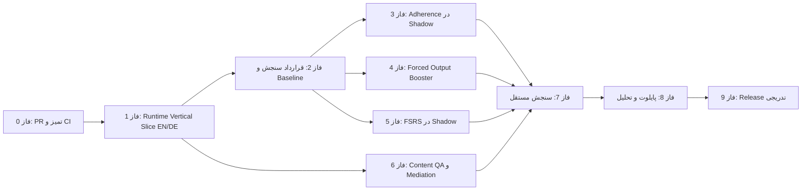

# رودمپ اجرایی اتوماتیک‌شدن زبان و شواهد پژوهشی

**نسخه:** 1.20

**آخرین به‌روزرسانی:** 2026-08-22
**دامنه:** English Automaticity و DeutschFlow (فقط این دو اپ — بدون پروژهٔ لیسانس)
**منبع:** فایل «نقد پداگوژیک، اثرگذاری و محتوا» و وضعیت واقعی مخزن
**نسخهٔ عمومی تأییدشده:** https://hajimohammadi-ki.github.io/APPS_root/

**Vercel جاری:** Evidence روی https://automaticity-evidence-roadmap.vercel.app/
و UX روی https://automaticity-ux-roadmap.vercel.app/ است. هر دو دامنهٔ دقیق در
انتشار v1.20 با artifactهای canonical مخزن همسان‌سازی و با HTTP 200 و SHA-256
یکسان تأیید شدند.

## تصمیم اصلی

هدف محصول «تمام‌کردن درس» یا افزایش XP نیست. هدف، تولید مستقل، صحیح و روان در
گفتار و نوشتار، بازیابی با تأخیر، اصلاح خطا و انتقال به موقعیت جدید است.

این رودمپ بر چهار اصل بنا شده است:

1. **اول یک vertical slice واقعی، بعد AI و دیتاست.**
2. **Rule Engine دربارهٔ شواهد و ارتقای سطح تصمیم می‌گیرد؛ LLM فقط کمک می‌کند.**
3. **تکمیل تمرین معادل mastery یا automaticity نیست.**
4. **هر ادعای اثرگذاری باید baseline، سنجش مستقل و عدم‌قطعیت داشته باشد.**

این سند جایگزین رودمپ UX نیست. ساده‌سازی منو و برنامهٔ روزانه در
`docs/roadmaps/UX-SIMPLIFICATION-ROADMAP-2026-08-20.md` دنبال می‌شود؛ این
سند مسیر شواهد یادگیری، پایداری استفاده، محتوا و ارزیابی را مشخص می‌کند.

## وضعیت واقعی در نقطهٔ شروع

| بخش | وضعیت تا 2026-08-22 | مدرک |
|---|---|---|
| هستهٔ مشترک learning-core | PR [#11](https://github.com/Hajimohammadi-KI/APPS_root/pull/11) پس از بازبینی مستقل و CI سبز merge شد | merge `ed7e73f` و `shared/learning-core` |
| SKILL-001 Adherence Core | روی `main` ادغام و فقط به‌صورت shadow به برنامهٔ 15/30/45 دقیقهٔ هر دو اپ متصل شده؛ flag پیش‌فرض خاموش و proposal هرگز روی برنامه یا دادهٔ زبان‌آموز اعمال/ذخیره نمی‌شود | `shared/learning-core/src/adherence/shadow-runner.ts` |
| تست اختصاصی adherence | تأییدشده پس از Guarded Nudges: 36 تست، 69,262 assertion | `bun run test:adherence-core` |
| کل تست learning-core | تأییدشده پس از PR #36: 87 تست و 71,660 assertion | `bun run test` |
| تست اختصاصی Forced Output Booster | 10 تست و 2,269 assertion؛ E2E انگلیسی 2/2 و آلمانی 2/2 | `bun run test:booster` و [run 32544972126](https://github.com/Hajimohammadi-KI/APPS_root/actions/runs/32544972126) |
| FSRS-6 Shadow | `ts-fsrs@5.4.1` و FSRS-6.0 ثابت؛ 12 تست و 35 assertion، بردار رسمی، بازپخش 1,000 تاریخچه، مقایسهٔ due-count، rollback و migration-loss | [PR #34](https://github.com/Hajimohammadi-KI/APPS_root/pull/34)، merge `00998b9`؛ [Core/App CI 32546150383](https://github.com/Hajimohammadi-KI/APPS_root/actions/runs/32546150383) و [German verify 32546150384](https://github.com/Hajimohammadi-KI/APPS_root/actions/runs/32546150384) سبز؛ Issue #5 بسته |
| مسیرهای canonical و E2E آلمانی | مالکیت `/heute`، `/grammatik`، `/studio`، `/einstellungen` و `/klassik` مستند شد؛ Shell تکراری Studio حذف بصری، CSS محدود به Studio، چیدمان container-responsive و انتظار PWA آفلاین به UI فعلی اصلاح شد | [PR #36](https://github.com/Hajimohammadi-KI/APPS_root/pull/36)، merge `463a82d`؛ 25 تست non-opt-in پاس و 2 تست opt-in جدا؛ PWA production/offline نیز پاس؛ [German CI 32547665744](https://github.com/Hajimohammadi-KI/APPS_root/actions/runs/32547665744) |
| انتشار DeutschFlow 20.8.25 | از `main` فعلی ساخته شد؛ نصب تازه، اجرای مستقیم دسکتاپ، وب/API واقعی، ارتقا از 20.8.24، repair پس از خرابی عمدی version marker، uninstall و حفظ دقیق دادهٔ ساختگی پاس شد | [PR #38](https://github.com/Hajimohammadi-KI/APPS_root/pull/38)، merge `6239e3c`؛ [CI 32548697753](https://github.com/Hajimohammadi-KI/APPS_root/actions/runs/32548697753)؛ Setup SHA-256 `B95AA51EE28E91B3A8493A239C57E8BB08CBC8F422741112EBEAAA98FD313724`؛ payload SHA-256 `52A99AC6E0A99001A9891E113F00DE7F77E5273B198199B9C79092F8720321CA` |
| انتشار English Automaticity 27.3.18 | Grammar Lab همچنان از منبع canonical مؤلف‌شده تولید می‌شود: 112 واحد و دقیقاً 6 تمرین برای هر واحد، در مجموع 672 تمرین. Research PDF Studio اکنون همراه Installer روی پورت loopback اختصاصی 4332 نصب و از Notebook/PDF باز می‌شود. 31/31 تست E2E اپ، 7 تست Reader و 2/2 تست مرورگر Reader پاس شد؛ نصب تازه، startup، ارتقا از 27.3.17، repair پس از خرابی عمدی، uninstall و حفظ داده نیز تأیید شد | [PR #47](https://github.com/Hajimohammadi-KI/APPS_root/pull/47)، merge `0e91c8f`؛ [English CI](https://github.com/Hajimohammadi-KI/APPS_root/actions/runs/32570722314)، [Reader CI](https://github.com/Hajimohammadi-KI/APPS_root/actions/runs/32570722315) و [Core CI](https://github.com/Hajimohammadi-KI/APPS_root/actions/runs/32570722323)؛ [Issue #43 بسته](https://github.com/Hajimohammadi-KI/APPS_root/issues/43)؛ Setup SHA-256 `CE6B6C998E713E1BA19380EBBD84FCC0AF97B503F94A5160D7D7BD744E9183FA`؛ payload SHA-256 `B7C92131DC9BEDD6122B85CC197B2DF2936F0BCC06B5C9E4618A392E95AC92C0` |
| چرخهٔ یکپارچهٔ PDF Reader | health دقیق، بازکردن PDF واقعی با شناسهٔ SHA-256 بدون افشای مسیر فایل، render و انتخاب متن، highlight، comment، export و reload در نصب تازه و پس از repair آزمون شد. viewport تبلت 800×1280 و حفظ داده پس از update/repair/uninstall نیز پاس شد | **تأیید release lifecycle**؛ این مدرک فنی جای G4/G5 یا سنجش outcome زبان‌آموز را نمی‌گیرد |
| وب عمومی انگلیسی، آلمانی و PDF Reader | در انتشار نهایی v1.20، هر دو اپ از `main` شامل PR #55 دوباره build و روی دامنه‌های production منتشر شدند؛ 12/12 مسیر انگلیسی و 20/20 مسیر آلمانی طبق قرارداد 200/307 پاس شدند. Home و Studio هر دو زبان در 800×1280 با `lang`/`dir` درست و بدون overflow تأیید شدند؛ Reader و `/api/health` نیز HTTP 200 و `ready=true` بودند | English deployment `dpl_GucT4dQJaSYFAycaCqmF3EyeWarS`؛ German deployment `dpl_EjiseWkNZ2zJkUetNdrFEimKsyEk`؛ [main CI 32577961398](https://github.com/Hajimohammadi-KI/APPS_root/actions/runs/32577961398) |
| انتشار صحیح Evidence و UX در GitHub Pages | Workflow فایل Evidence را فقط در root و مسیر Evidence، و فایل واقعی UX را در مسیر UX منتشر می‌کند؛ CI وجود هر سه artifact، برابری root/Evidence، تفاوت Evidence/UX و marker اختصاصی UX را کنترل می‌کند. هر سه URL HTTP 200 هستند و UX در 800×1280، RTL و بدون overflow یا log هشدار/خطا تأیید شد | [PR #52](https://github.com/Hajimohammadi-KI/APPS_root/pull/52)، merge `abd77e4` و [Pages deploy 32575429454](https://github.com/Hajimohammadi-KI/APPS_root/actions/runs/32575429454) |
| انتشار Vercel رودمپ v1.20 | دامنه‌های دقیق Evidence و UX به artifactهای canonical همین مخزن متصل شدند؛ هر دو URL HTTP 200 و محتوای دریافت‌شده byte-for-byte و SHA-256 برابر خروجی محلی بود. بسته‌های مستقل سایت و CI انتشار در PR #54 و اصلاح trace آلمانی با verify کامل در PR #55 وارد `main` شدند | [Evidence](https://automaticity-evidence-roadmap.vercel.app/)؛ [UX](https://automaticity-ux-roadmap.vercel.app/)؛ [PR #54](https://github.com/Hajimohammadi-KI/APPS_root/pull/54) `40454da`؛ [PR #55](https://github.com/Hajimohammadi-KI/APPS_root/pull/55) `f72210a`؛ [CI 32577961398](https://github.com/Hajimohammadi-KI/APPS_root/actions/runs/32577961398) |
| TypeScript و mirror parity | تأییدشده در این بررسی | `bun run typecheck` و `node sync-workspaces.mjs --check` |
| CI اختصاصی | هر دو workflow PR #11 سبز و PR merge شده است | [Learning Core run 32505151386](https://github.com/Hajimohammadi-KI/APPS_root/actions/runs/32505151386) و [German run 32505151423](https://github.com/Hajimohammadi-KI/APPS_root/actions/runs/32505151423) |
| اصلاح runtime و مسیرهای آلمانی | PR [#13](https://github.com/Hajimohammadi-KI/APPS_root/pull/13) پس از تست کامل محلی و CI لینوکس merge شد | merge `b3fbc07` و [run 32510365622](https://github.com/Hajimohammadi-KI/APPS_root/actions/runs/32510365622) |
| ادغام runtime در هر دو اپ | مسیر B1 نوشتن/گفتار، audio gate، invalidation، provider-unavailable و eventهای جدا در هر دو زبان ادغام شد | **Gate G1 عبور کرد:** [PR #17](https://github.com/Hajimohammadi-KI/APPS_root/pull/17)، merge `b452e3e`، [Issue #14](https://github.com/Hajimohammadi-KI/APPS_root/issues/14) بسته |
| export محلی شواهد | صفحهٔ Settings انگلیسی و export نسخه‌دار هر دو زبان روی `main` ادغام شد | [PR #16](https://github.com/Hajimohammadi-KI/APPS_root/pull/16)، merge `17341f7`؛ E2E دانلود واقعی هر دو زبان پاس شد |
| CI مربوط به G1 | Learning Core و German Automaticity هر دو سبز | [Core run 32532317547](https://github.com/Hajimohammadi-KI/APPS_root/actions/runs/32532317547) و [German run 32532317531](https://github.com/Hajimohammadi-KI/APPS_root/actions/runs/32532317531) |
| قرارداد سنجش و حریم خصوصی | رضایت نسخه‌دار، baseline پیش از intervention، export امن، revoke/delete، retention و data-quality در هر دو اپ ادغام شد | **Gate G2 عبور کرد:** [PR #21](https://github.com/Hajimohammadi-KI/APPS_root/pull/21)، merge `032ad14`، [Issue #18](https://github.com/Hajimohammadi-KI/APPS_root/issues/18) بسته |
| CI مربوط به G2 | Learning Core و German Automaticity هر دو سبز؛ Settings E2E در انگلیسی و آلمانی پاس شد | [Core run 32535274524](https://github.com/Hajimohammadi-KI/APPS_root/actions/runs/32535274524) و [German run 32535274583](https://github.com/Hajimohammadi-KI/APPS_root/actions/runs/32535274583) |
| Shadow Safety در هر دو اپ | adapter خالص و default-off، مقایسهٔ 15/30/45 دقیقه، fail-closed، عدم persistence و E2E حفظ داده در انگلیسی و آلمانی ادغام شد | **Gate G3 عبور کرد:** [PR #24](https://github.com/Hajimohammadi-KI/APPS_root/pull/24)، merge `ea3d25c`، [Issue #23](https://github.com/Hajimohammadi-KI/APPS_root/issues/23) بسته |
| CI مربوط به G3 | Learning Core و German Automaticity هر دو سبز؛ browser adapter در هر سه کپی hash-identical و زیر بودجهٔ 5 KiB gzip است | [Core run 32537261291](https://github.com/Hajimohammadi-KI/APPS_root/actions/runs/32537261291) و [German run 32537261468](https://github.com/Hajimohammadi-KI/APPS_root/actions/runs/32537261468) |
| زیرساخت Content Quality | schema نسخه‌دار mediation، rubric ثابت، دو بازبین مستقل، weighted kappa، adjudication و quarantine محتوای تأییدنشده در هر دو زبان ادغام شد | [PR #26](https://github.com/Hajimohammadi-KI/APPS_root/pull/26)، merge `8edaba2`؛ [Core/Content run 32538983463](https://github.com/Hajimohammadi-KI/APPS_root/actions/runs/32538983463) و [German run 32538983363](https://github.com/Hajimohammadi-KI/APPS_root/actions/runs/32538983363) سبز |
| بازبینی انسانی پایلوت G4 | هنوز انجام نشده؛ هر دو draft با `humanReviewed=false` و `awaiting-human-review` از daily plan حذف می‌شوند | **N/A — Gate G4 هنوز عبور نکرده است** |
| Implementation Intentions | انتخاب اختیاری 0 یا 2 تا 5 برنامهٔ زمان/مکان در Settings هر دو زبان، ذخیرهٔ local-only، متن EN/DE/FA و حذف/بازیابی پس از reload ادغام شد؛ هیچ nudge یا event ساخته نمی‌شود | [PR #28](https://github.com/Hajimohammadi-KI/APPS_root/pull/28)، merge `32e8a8c`؛ [Core run 32541173665](https://github.com/Hajimohammadi-KI/APPS_root/actions/runs/32541173665) و [German run 32541173644](https://github.com/Hajimohammadi-KI/APPS_root/actions/runs/32541173644) سبز؛ [Issue #6](https://github.com/Hajimohammadi-KI/APPS_root/issues/6) بسته |
| Guarded in-app nudges | در هر دو اپ با opt-in صریح و پیش‌فرض خاموش، ترتیب guard قطعی، quiet hours، cooldown، سقف روزانه/هفتگی، رویداد محلی کمینه و متن EN/DE/FA ادغام شد؛ push/email و ادعای outcome وجود ندارد | [PR #30](https://github.com/Hajimohammadi-KI/APPS_root/pull/30)، merge `4e08775`؛ [Core/Content run 32542941048](https://github.com/Hajimohammadi-KI/APPS_root/actions/runs/32542941048) و [Browser run 32542941037](https://github.com/Hajimohammadi-KI/APPS_root/actions/runs/32542941037) سبز؛ [Issue #7](https://github.com/Hajimohammadi-KI/APPS_root/issues/7) بسته |
| Forced Output Booster | در هر دو اپ با `booster_mode` پیش‌فرض خاموش، 3 تا 5 دور 30 تا 90 ثانیه‌ای فقط از سهم `automatization`، ضبط واقعی یا fallback تایپ، metadata کمینه و منع قطعی mastery/automaticity ادغام شد | [PR #32](https://github.com/Hajimohammadi-KI/APPS_root/pull/32)، merge `1c6fb95`؛ [Core/Browser run 32544972126](https://github.com/Hajimohammadi-KI/APPS_root/actions/runs/32544972126) و [German run 32544972169](https://github.com/Hajimohammadi-KI/APPS_root/actions/runs/32544972169) سبز؛ [Issue #4](https://github.com/Hajimohammadi-KI/APPS_root/issues/4) بسته |
| AI و دیتاست runtime | هنوز نباید وارد runtime یا تصمیم mastery شود | ingestion محتوای پایلوت وابسته به تکمیل بازبینی انسانی G4 است |
| اثرگذاری روی زبان‌آموز واقعی | دادهٔ کافی وجود ندارد | **N/A تا اجرای پایلوت** |

> سبزشدن تست‌های pure TypeScript فقط صحت قراردادها و invariants را نشان می‌دهد؛
> این نتیجه، به‌تنهایی اثبات نمی‌کند که کاربر واقعاً زبان را اتوماتیک می‌کند.

## لینک‌های عمومی و اجرای محلی تأییدشده تا 2026-08-22

| سرویس | لینک ویندوز | لینک تبلت/Android در همان Wi-Fi | وضعیت |
|---|---|---|---|
| رودمپ عمومی | [Evidence روی Vercel](https://automaticity-evidence-roadmap.vercel.app/) · [GitHub Pages](https://hajimohammadi-ki.github.io/APPS_root/) | [UX روی Vercel](https://automaticity-ux-roadmap.vercel.app/) · [UX روی Pages](https://hajimohammadi-ki.github.io/APPS_root/automaticity-ux-roadmap/) | HTTPS عمومی؛ HTTP 200؛ RTL؛ artifactهای Vercel در انتشار v1.20 با فایل‌های محلی hash-identical تأیید شدند |
| App Starter | [127.0.0.1:4300](http://127.0.0.1:4300/) | فقط میزبان ویندوز | HTTP 200؛ health سریع و بدون خطای کاذب startup |
| English Automaticity | [127.0.0.1:3202](http://127.0.0.1:3202/) | [192.168.178.24:3202](http://192.168.178.24:3202/) | HTTP 200 و browser smoke test |
| DeutschFlow | [127.0.0.1:3210](http://127.0.0.1:3210/) | [192.168.178.24:3210](http://192.168.178.24:3210/) | HTTP 200 و browser smoke test |
| Cross Repository Tracker | [127.0.0.1:4312](http://127.0.0.1:4312/) | هنوز روی LAN منتشر نشده | HTTP 200 روی ویندوز؛ WSL relay لازم است |

این جدول فقط **دسترس‌پذیری runtime محلی** را ثبت می‌کند و مدرک عبور G1، اثرگذاری
یادگیری یا چرخهٔ انتشار G6 نیست. پس از restart ویندوز، `START-APPS.cmd` باید اجرا
شود؛ اگر IP داخلی WSL تغییر کرده باشد، Windows ممکن است برای اصلاح bridge یک
UAC تأییدشده درخواست کند.

## نقشهٔ وابستگی

فازهای 3، 4، 5 و بخش authoring فاز 6 پس از عبور G1 و G2 می‌توانند در
شاخه‌های جدا پیش بروند؛ هیچ‌کدام نباید در یک PR بزرگ با دیگری ادغام شود.

## دروازه‌های اجباری

| Gate | شرط عبور | اگر عبور نکرد |
|---|---|---|
| **G0 — Source Gate** | چهار مسیر SKILL-001 در PR جدا، review و CI سبز | هیچ فاز وابسته merge نشود |
| **G1 — Runtime Evidence Slice** | ✅ در PR #17 عبور کرد: یک واحد B1 انگلیسی و آلمانی از content تا evidence و export عبور می‌کند | میکروفون سخت‌افزاری و provider زنده همچنان N/A و در G6/پایلوت بررسی شوند |
| **G2 — Measurement Contract** | ✅ در PR #21 عبور کرد: event schema، consent، privacy، baseline، retention و data-quality checks در هسته و هر دو اپ ادغام شدند | اثرگذاری روی زبان‌آموز واقعی همچنان N/A تا پایلوت است |
| **G3 — Shadow Safety** | ✅ در PR #24 عبور کرد: خروجی جدید کنار برنامهٔ فعلی محاسبه می‌شود؛ E2E هر دو زبان ثابت می‌کند UI و دادهٔ learner/evidence تغییر نمی‌کنند | flag پیش‌فرض خاموش می‌ماند؛ اثر یادگیری همچنان N/A است |
| **G4 — Content Quality** | 🟡 زیرساخت در PR #26 ادغام شد؛ provenance، مجوز، rubric، quarantine و CI موجود است، اما دو بازبین انسانی واقعی و agreement هنوز N/A هستند | draftها وارد برنامهٔ روزانه نمی‌شوند و Issue #8 باز می‌ماند |
| **G5 — Learning Evidence** | pre/post مستقل، delayed recall و novel transfer با دادهٔ واقعی | واژهٔ «automatic» فقط هدف محصول باشد، نه نتیجهٔ اثبات‌شده |
| **G6 — Release Lifecycle** | build، E2E، responsive، Install/Update/Repair و حفظ داده پاس شوند؛ DeutschFlow 20.8.25 و English 27.3.18، شامل PDF Reader متصل، چرخهٔ انتشار خود را گذرانده‌اند. Gate سراسری همچنان تا G4/G5 باز است | هیچ انتشار جدیدی بدون تکرار چرخه انجام نشود؛ شواهد release به‌جای human review یا outcome واقعی استفاده نشوند |

> **چرا G1 فقط روی یک سطح (B1) تعریف شده، نه همهٔ سطوح؟** هدف G1 اثبات
> درستی مسیر فنی (pipeline) است، نه پوشش محتوا — سطح فقط metadata روی
> `ContentUnit` است و منطق pipeline را تغییر نمی‌دهد. اگر همزمان با هر شش
> سطح شروع شود، هر باگ ممکن است از معماری باشد یا از محتوای همان سطح —
> قابل تفکیک نیست. B1 هم انتخاب شده چون اولین سطحی است که زبان‌آموز متن
> به‌هم‌پیوسته تولید می‌کند، پس موتور ارزیابی (delayed recall، novel
> transfer، speaking) را واقعی‌تر از A1 زیر فشار می‌گذارد. پس از عبور G1،
> همان مسیر برای A1 تا C2 هم کار می‌کند؛ آنچه می‌ماند نوشتن و بازبینی
> محتوای آن سطوح است — دقیقاً کار فاز 6 و Gate G4، نه یک محدودیت دائمی.

## فاز 0 — تفکیک و merge کردن Vertical Slice 1

**برآورد:** 1 تا 2 روز کاری
**وضعیت:** کامل؛ review، CI و merge انجام شد

**Issue:** [#3 — Local-first adherence core](https://github.com/Hajimohammadi-KI/APPS_root/issues/3)
**PR:** [#11 — Vertical Slice 1 core, mirrors, and CI gate](https://github.com/Hajimohammadi-KI/APPS_root/pull/11) (`c666175` → merge `ed7e73f`)

فقط این چهار مسیر وارد PR نخست شوند:

1. `shared/learning-core`
2. `Apps/English/English-07082026/packages/learning-core`
3. `Apps/Deutsch-V10.08.2026/packages/learning-core`
4. `.github/workflows/learning-core-adherence-ci.yml`

### خروجی

- یک source of truth و دو mirror قابل کنترل؛
- adherence pure TypeScript، بدون UI، backend، push notification یا LLM؛
- feature flag با پیش‌فرض `false`؛
- CI برای typecheck، تست‌ها، اندازهٔ bundle و mirror parity.

### معیار خروج

- [x] PR مستقل فقط محدودهٔ source/mirrors/CI و lockfileهای workspace لازم را دارد؛
- [x] CI روی PR سبز است؛
- [x] فایل‌های نامرتبط worktree وارد commit نشده‌اند؛
- [x] review و merge PR #11 انجام شد؛
- [x] SKILL-001 روی `main` ادغام شد؛ فعال‌سازی محصولی آن همچنان تابع G2 و G3 است.

## فاز 1 — Vertical Slice واقعی در English و Deutsch

**برآورد:** 1 sprint
**وابستگی:** G0
**وضعیت:** ✅ کامل؛ [Issue #14](https://github.com/Hajimohammadi-KI/APPS_root/issues/14) با merge شدن [PR #17](https://github.com/Hajimohammadi-KI/APPS_root/pull/17) در `b452e3e` بسته شد
**CI:** [Learning Core 32532317547](https://github.com/Hajimohammadi-KI/APPS_root/actions/runs/32532317547) و [German Automaticity 32532317531](https://github.com/Hajimohammadi-KI/APPS_root/actions/runs/32532317531) سبز
**هدف:** تبدیل قرارداد pure core به مسیر واقعی یادگیری در هر دو اپ.

### محدوده

- یک واحد authored و human-reviewed در سطح B1 برای هر زبان؛
- مسیر کامل `content → daily plan → learner response → evaluation → evidence → local event`؛
- یک تلاش نوشتاری و یک تلاش گفتاری با صدای واقعی؛
- Conversation Studio با مسیر
  `Listen/Recall → Record → Replay → Review transcript → Correct → Improve → Save`؛
- transcript و evaluation واقعی؛ هیچ پاسخ hard-coded یا demo evidence پذیرفته نیست؛
- رویدادها فقط شناسه و metadata کمینه داشته باشند؛ متن و صوت در analytics event کپی نشود.

### معیار خروج

- E2E برای EN و DE نشان دهد با re-record، evidence قبلی باطل می‌شود؛
- speaking بدون audio معتبر، mastery-eligible نشود؛
- پاسخ اشتباه، completion یا تایمر 60 ثانیه status automatic ندهد؛
- delayed recall و novel transfer به‌صورت event جدا قابل ثبت باشند؛
- خطای provider با وضعیت unavailable دیده شود، نه موفقیت جعلی.

### خروجی تأییدشده

- PR آلمانی [#13](https://github.com/Hajimohammadi-KI/APPS_root/pull/13) با تست‌های
  typecheck، lint، unit/integration، installer، schema، build و 15 E2E (به‌علاوهٔ
  2 تست اختیاری PWA که skip شدند) merge شده است؛
- `learning-core` برای تلاش‌های انگلیسی و آلمانی ledger محلی نسخه‌دار می‌سازد و
  speaking بدون audio را `unverified` نگه می‌دارد؛
- PR [#16](https://github.com/Hajimohammadi-KI/APPS_root/pull/16) با commits
  `c79d5f2` و `e5dbd28` خروجی هر دو اپ را اصلاح کرد تا `learnerState` و
  `learningEvidence` را با envelope نسخه‌دار صادر کند؛ تست دانلود واقعی مرورگر
  در هر دو زبان پاس شد و در merge `17341f7` وارد `main` شد؛
- build تولیدی هر دو اپ پاس شد و سرویس‌های محلی دوباره با HTTP 200 بالا آمدند.
- PR [#17](https://github.com/Hajimohammadi-KI/APPS_root/pull/17) مسیرهای واقعی EN/DE را با
  34 تست هسته، 4 E2E متمرکز انگلیسی و 2 E2E متمرکز آلمانی کامل کرد؛
- `learning.evidence.invalidated.v1` برای re-record و eventهای مستقل
  `learning.delayed-recall.recorded.v1` و `learning.novel-transfer.recorded.v1`
  در ledger/export ثبت می‌شوند؛
- خطای provider evidence موفق ذخیره نمی‌کند و completion یا 60 ثانیه گفتار فقط
  `insufficient-longitudinal-evidence` باقی می‌ماند؛
- 320px reflow، فعال‌سازی با صفحه‌کلید و reduced motion در E2E متمرکز پوشش داده شد.

**مرز صادقانهٔ شواهد:** تست مرورگر از WAV مصنوعیِ غیرخالی و provider intercept‌شده
استفاده کرد. آزمون مستقل microphone سخت‌افزاری واقعی و provider خارجی زنده در این
مرحله **N/A — هنوز به‌اندازهٔ کافی تأیید نشده** است و به‌عنوان `VERIFIED` گزارش
نمی‌شود. این محدودیت در G6/پایلوت باقی می‌ماند، اما قرارداد deterministic لازم برای
عبور G1 روی `main` ادغام و در CI اثبات شده است.

## فاز 2 — قرارداد سنجش، حریم خصوصی و Baseline

**برآورد:** 1 sprint
**وابستگی:** G1
**وضعیت:** ✅ کامل؛ [Issue #18](https://github.com/Hajimohammadi-KI/APPS_root/issues/18) با [PR #21](https://github.com/Hajimohammadi-KI/APPS_root/pull/21) و merge `032ad14` بسته شد
**گام‌های بعدی:** [#9 — Independent assessment](https://github.com/Hajimohammadi-KI/APPS_root/issues/9) و [#10 — Learning analytics](https://github.com/Hajimohammadi-KI/APPS_root/issues/10) پس از Gateهای وابسته

### کارها

- نسخه‌گذاری event schema و content schema؛
- تعریف رضایت آگاهانه، retention، export و deletion داده؛
- ثبت baseline قبل از روشن‌کردن هر intervention؛
- جداسازی متریک engagement از learning outcome؛
- بررسی completeness، uniqueness، validity و leakage برای داده‌ها؛
- تعریف rubric انسانی برای گفتار و نوشتار.

### متریک‌های اصلی

| نوع | متریک | تفسیر درست |
|---|---|---|
| تولید | `first_attempt_valid_rate` | تلاش اول بدون hint/model answer |
| گفتار | `time_to_first_valid_speech` | زمان تا اولین صدای ارزیابی‌پذیر، نه تا کلیک Start |
| بازیابی | `delayed_recall_rate` | موفقیت روی محتوای جدا و با تأخیر |
| انتقال | `novel_transfer_rate` | استفادهٔ صحیح در موضوع یا موقعیت تازه |
| اصلاح | `independent_repair_rate` | اصلاح بدون نمایش جواب کامل |
| پایداری | `return_after_gap_rate` | بازگشت پس از وقفه؛ جدا از outcome |
| ایمنی | `false_positive_rate` | نمونهٔ انسانی‌برچسب‌خورده، جدا برای زبان/سطح/دستگاه |

هدف عددی پیش از baseline تعیین نمی‌شود. پس از baseline، target باید همراه با
بازهٔ عدم‌قطعیت و guardrail کیفیت یادگیری تصویب شود.

### خروجی تأییدشدهٔ G2

- رضایت opt-in نسخه‌دار، revoke، حذف دادهٔ سنجش و retention محلی 365روزه در هستهٔ مشترک پیاده شد؛
- baseline فقط با رضایت معتبر و پیش از هر intervention ثبت می‌شود؛
- export پژوهشی allowlist دارد و متن خام، صوت، ایمیل و شناسهٔ مستقیم را خارج نمی‌کند؛ backup کامل یادگیری جدا باقی مانده است؛
- گزارش کیفیت completeness، uniqueness، validity، time/version و privacy leakage را deterministic بررسی می‌کند؛ نبود نمونه با `N/A` گزارش می‌شود؛
- 43 تست هسته و E2E واقعی Settings برای هر دو زبان پاس شد؛ دادهٔ cohort واقعی و اثر یادگیری همچنان `N/A` است.

## فاز 3 — Adherence Engineering در Shadow

**برآورد:** 1 تا 2 sprint
**وابستگی:** G2
**Issues:** [#6 — Implementation intentions](https://github.com/Hajimohammadi-KI/APPS_root/issues/6)، [#7 — Guarded nudges](https://github.com/Hajimohammadi-KI/APPS_root/issues/7)

**وضعیت 2026-08-22:** Shadow Safety در [PR #24](https://github.com/Hajimohammadi-KI/APPS_root/pull/24)، Implementation Intentions در [PR #28](https://github.com/Hajimohammadi-KI/APPS_root/pull/28) و Guarded Nudges در [PR #30](https://github.com/Hajimohammadi-KI/APPS_root/pull/30) با merge `4e08775` و چهار check سبز ادغام شدند. اعلان فقط پس از opt-in صریح و عبور guardهای قطعی داخل اپ ظاهر می‌شود؛ push/email ندارد، focus را جابه‌جا نمی‌کند و رویدادهایش learning outcome نیستند. Issues [#6](https://github.com/Hajimohammadi-KI/APPS_root/issues/6) و [#7](https://github.com/Hajimohammadi-KI/APPS_root/issues/7) بسته‌اند؛ micro-goal و comeback flow محصولی هنوز باقی است.

### ترتیب اجرا

1. اتصال SKILL-001 به برنامهٔ 15/30/45 دقیقه فقط در shadow؛
2. ✅ ذخیرهٔ اختیاری implementation intention در Settings هر دو اپ؛
3. micro-goal پنج‌دقیقه‌ای برای روزهای کم‌انرژی، بدون حذف کامل productive output؛
4. comeback flow بدون شرم‌دادن یا صفرکردن دستاورد واقعی؛
5. ✅ فقط in-app prompt با consent و cooldown؛ push/email در این فاز ممنوع؛
6. مقایسهٔ پیشنهاد shadow با برنامهٔ واقعی، بدون تغییر تجربهٔ کاربر.

### معیار خروج

- خاموش‌کردن flag رفتار قبلی را دقیقاً برگرداند؛
- timezone، چند session در یک روز، gap، freeze و comeback deterministic باشند؛
- هیچ nudge بدون opt-in ظاهر نشود؛
- `nudge → session` جدا از `session → learning gain` گزارش شود؛
- adherence به‌تنهایی mastery یا automaticity نسازد.

## فاز 4 — Forced Output Booster

**وضعیت 2026-08-22:** در [PR #32](https://github.com/Hajimohammadi-KI/APPS_root/pull/32) با merge `1c6fb95` و شش check سبز ادغام شد؛ Issue #4 بسته است. feature flag پیش‌فرض خاموش است و فعال‌شدن به `booster_mode=true` همراه `?mode=booster` نیاز دارد. کیفیت میکروفون واقعی، latency سخت‌افزاری، ASR و اثر یادگیری همچنان **N/A — هنوز به‌اندازهٔ کافی تأیید نشده** هستند.

**برآورد اولیه:** 1 تا 2 sprint
**وابستگی:** G2 و محتوای authored معتبر
**Issue/PR:** [#4 — Forced-output booster](https://github.com/Hajimohammadi-KI/APPS_root/issues/4) و [PR #32](https://github.com/Hajimohammadi-KI/APPS_root/pull/32)

### طراحی محصول

- 3 تا 5 دور کوتاه 30 تا 90 ثانیه‌ای، پشت feature flag؛
- picture description، situation reaction، continuation، transformation و mini-argument؛
- fallback تایپ برای نبود میکروفون یا نیاز دسترس‌پذیری؛
- ضبط با `MediaRecorder` و ذخیرهٔ Blob در IndexedDB؛ متن خام و صوت وارد
  `localStorage` نمی‌شوند؛
- زمان فقط از بلوک موجود `automatization` گرفته می‌شود و بلوک ششمی به برنامه
  اضافه نمی‌شود؛
- برنامهٔ 45 دقیقه‌ای فقط نسخهٔ کشیدهٔ 15 دقیقه‌ای نباشد: گفتار طولانی‌تر،
  نوشتن مستقل و بیش از یک زمینهٔ انتقال داشته باشد؛
- سختی و حجم بر اساس مدت انتخابی تغییر کند، اما سطح فقط با کیفیت شواهد ارتقا یابد.

### معیار خروج

- ✅ تلاش واقعی با attempt/round/plan/target ID مرتبط ذخیره می‌شود؛ latency اولین
  تولید و self-repair در قرارداد قابل ثبت است؛
- ✅ واژهٔ کلیدی یا fragment ناقص به‌تنهایی structure use محسوب نمی‌شود؛
- ✅ Booster قابل ردکردن و flag پیش‌فرض خاموش است؛
- ✅ composite و اجزای آن در بازهٔ `0..1` می‌مانند و هیچ mastery یا ارتقای سطحی
  از یک Booster ساخته نمی‌شود؛
- ✅ هیچ آستانهٔ جهانی «صدها تکرار» در کد hard-code نشده است.

## فاز 5 — ارزیابی FSRS در Shadow

**وضعیت 2026-08-22:** زیرساخت فنی در [PR #34](https://github.com/Hajimohammadi-KI/APPS_root/pull/34) با merge `00998b9` و هشت check سبز ادغام شد؛ Issue #5 بسته است. FSRS فقط با `fsrs_shadow_v1=true` فعال می‌شود، موعد واقعی زبان‌آموز را عوض نمی‌کند و `rolloutEligible=false` باقی می‌ماند. دورهٔ واقعی prospective، retention، workload و overdue burden هنوز **N/A — هنوز به‌اندازهٔ کافی تأیید نشده** هستند.

**برآورد اولیه:** 1 تا 2 sprint
**وابستگی:** G2
**Issue/PR:** [#5 — FSRS shadow migration](https://github.com/Hajimohammadi-KI/APPS_root/issues/5) و [PR #34](https://github.com/Hajimohammadi-KI/APPS_root/pull/34)

### کارها

- pin کردن `ts-fsrs@5.4.1`، FSRS-6.0 و commit رسمی upstream؛
- تشخیص صریح اینکه دادهٔ قدیمی aggregate-only است و برای seed معتبر کافی نیست؛
- جمع‌آوری آینده‌نگر rating و timestamp فقط پس از opt-in؛
- محاسبهٔ due date فعلی و FSRS در کنار هم، بدون تغییر برنامهٔ کاربر؛
- ثبت اختلاف زمان‌بندی و rollback metadata؛
- بازپخش قطعی 1,000 تاریخچه، due-count و benchmark latency؛
- استفاده از پیاده‌سازی معتبر FSRS؛ نه الگوریتم مبتنی بر `ease factor` و نه
  invariant نامعتبر `stability >= difficulty`.

### معیار خروج

- ✅ بردار رسمی، بازپخش deterministic، idempotence، capacity و rollback پاس شده‌اند؛
- ✅ scheduler فعلی source of truth مانده و خاموش‌کردن flag فقط دادهٔ shadow را کنار می‌گذارد؛
- ⏳ حداقل یک دورهٔ واقعی prospective shadow هنوز اجرا نشده است؛
- ⏳ فعال‌سازی learner-visible فقط پس از بررسی retention، workload و overdue burden ممکن است.

## فاز 6 — Content QA، Mediation و پایلوت دیتاست

**برآورد:** 2 تا 3 sprint
**وابستگی:** G1؛ G2 عبور کرده و ingestion runtime اکنون وابسته به G4 است
**Issue:** [#8 — CEFR mediation pilot](https://github.com/Hajimohammadi-KI/APPS_root/issues/8)

**وضعیت 2026-08-22:** زیرساخت و draft محدود در
[PR #26](https://github.com/Hajimohammadi-KI/APPS_root/pull/26) با merge
`8edaba2` و دو CI سبز ادغام شد. یک آیتم authored B1 برای هر زبان وجود دارد، اما
هر دو `awaiting-human-review` هستند و release array آن‌ها خالی است. بازبینی
native-speaker و language-pedagogy، adjudication احتمالی و agreement واقعی هنوز
`N/A — not sufficiently verified` است؛ بنابراین G4 عبور نکرده است.

### ContentUnit مشترک

هر واحد باید language، CEFR، version، source/license، reviewer status و حداقل
یکی از modeهای recognition، recall، writing، speaking، repair، transfer یا mediation
را داشته باشد. شناسهٔ فنی خودکار تولید شود؛ مدرس مجبور به واردکردن context key
نباشد.

### پایلوت Mediation

- ابتدا B1، برای هر زبان یک مجموعهٔ کوچک guided و independent؛
- خلاصه‌کردن، بازگویی، توضیح برای مخاطب دیگر و انتقال اطلاعات؛
- Reception، Production، Interaction و Mediation جدا گزارش شوند؛
- rubric و نمونهٔ anchor توسط بازبین انسانی تأیید شود.

### دیتاست‌های نامزد پس از Gate

| منبع | استفادهٔ مجاز | استفادهٔ غیرمجاز |
|---|---|---|
| Tatoeba CC0 | candidate متن کوتاه پس از QA | ورود خودکار صوت یا جملهٔ تأییدنشده |
| Common Voice | robustness ترنسکریپت EN/DE | نمرهٔ قطعی تلفظ زبان‌آموز |
| FLEURS | benchmark ثابت ASR | محتوای آموزشی یا mastery evidence |
| MERLIN | نمونهٔ خطای واقعی آلمانی و CEFR | استفاده بدون رعایت CC BY-SA |
| UD English EWT / German GSD | ویژگی نحوی کمکی | ادعای CEFR یا خطای زبان‌آموز |
| W&I + LOCNESS / C4 200M GEC | پژوهش GEC پس از بررسی مجوز | seed مستقیم Installer یا evidence تسلط |

دانلود حجیم، fine-tune و افزودن داده به installer تا عبور G4 انجام
نمی‌شود. کاتالوگ metadata-only به معنی «دیتاست استفاده‌شده در مدل» نیست.

### معیار خروج

- 100٪ آیتم‌های پایلوت provenance، مجوز و version داشته باشند؛
- نمونه‌گیری طبقه‌بندی‌شده و دو بازبین مستقل برای naturalness و CEFR alignment؛
- هیچ آیتم QA-failed در برنامهٔ روزانه schedule نشود؛
- محتوای درس همچنان authored و teacher-reviewed بماند.

## فاز 7 — سنجش مستقل automaticity

**برآورد:** 1 تا 2 sprint برای ابزار، سپس اجرای مطالعه
**وابستگی:** G3 و G4
**Issue:** [#9 — Independent assessment](https://github.com/Hajimohammadi-KI/APPS_root/issues/9)

### پروتکل

- pre-test و post-test جدا از محتوای تمرین روزانه؛
- تلاش اول بدون دیدن جواب، سپس delayed recall و novel transfer؛
- speaking با audio واقعی و writing با متن مستقل؛
- دو ارزیاب یا adjudication برای نمونهٔ اختلاف‌دار؛
- گزارش سطح زبان، زمان تمرین 15/30/45، دستگاه و شرایط provider؛
- C-test فقط شاخص کمکی proficiency عمومی است، نه مدرک automaticity؛
- IRT فقط پس از calibration نمونه و بررسی fit استفاده شود.

### معیار خروج

- rubric و scorer agreement مستند؛
- false positive/negative با مجموعهٔ انسانی‌برچسب‌خورده؛
- retention بعد از تأخیر سنجیده شود؛
- نتیجه با confidence interval و محدودیت‌ها گزارش شود، نه درصد قطعی تبلیغاتی.

## فاز 8 — پایلوت رضایت‌محور و Analytics

**برآورد:** 4 تا 8 هفته جمع‌آوری داده پس از آماده‌شدن ابزار
**وابستگی:** G5
**Issue:** [#10 — Learning analytics](https://github.com/Hajimohammadi-KI/APPS_root/issues/10)

### طراحی پایلوت

- ابتدا internal، سپس cohort کوچک با رضایت آگاهانه؛
- rollout ترتیبی: control → shadow → opt-in intervention؛
- گزارش جداگانه برای EN/DE و برنامه‌های 15/30/45 دقیقه؛
- attrition و missing data به‌عنوان نتیجه گزارش شوند، نه حذف شوند؛
- اگر فقط یک کاربر یا یک دستگاه وجود دارد، فقط descriptive local analytics
  مجاز است؛ Kaplan-Meier، AUC یا ادعای cohort ساخته نمی‌شود.

### تصمیم Go/No-Go

Intervention فقط وقتی گسترش می‌یابد که:

- learning outcome بدتر نشده باشد؛
- false positive افزایش معنادار نداشته باشد؛
- completion صرف، علت ظاهری موفقیت نباشد؛
- consent، export و deletion کار کنند؛
- اثر برای حداقل یکی از delayed recall یا novel transfer دیده شود.

## فاز 9 — انتشار تدریجی وب، PWA و Windows

**برآورد:** در پایان هر بستهٔ تغییر substantive
**وابستگی:** G6

برای هر دو اپ، Definition of Done انتشار شامل موارد زیر است:

- typecheck، lint، unit/integration و E2E؛
- تست real runtime و HTTP، نه فقط build؛
- Windows، تبلت و Android browser در viewportهای بحرانی؛
- reflow در 320px، keyboard focus، Screen Reader، target حداقل 44×44 و
  `prefers-reduced-motion`؛
- LTR برای انگلیسی/آلمانی، RTL برای فارسی و `dir="auto"` برای محتوای متغیر؛
- Offline/PWA و recovery پس از قطع شبکه؛
- بازسازی Install/Update/Repair و payload؛
- fresh install، startup، update، repair، uninstall و حفظ دادهٔ کاربر؛
- گزارش نسخه، مسیر دقیق installer و checksum؛
- microphone و provider خارجی که واقعاً آزموده نشده‌اند با `N/A` یا `BLOCKED`
  گزارش شوند.

## ترتیب PRها و Issueها

| ترتیب | محدوده | Issue | شرط شروع |
|---:|---|---|---|
| 1 | Adherence core + mirrors + CI | [#3](https://github.com/Hajimohammadi-KI/APPS_root/issues/3) | اکنون، پس از جداسازی worktree |
| 2 | تفکیک baseline اپ‌ها از PR conflicted شمارهٔ 2 | [#15](https://github.com/Hajimohammadi-KI/APPS_root/issues/15) و [PR #16](https://github.com/Hajimohammadi-KI/APPS_root/pull/16) | ✅ merge `17341f7` |
| 3 | Runtime evidence slice EN/DE | [#14](https://github.com/Hajimohammadi-KI/APPS_root/issues/14) و [PR #17](https://github.com/Hajimohammadi-KI/APPS_root/pull/17) | ✅ merge `b452e3e`؛ G1 عبور کرد |
| 4 | Measurement contract، consent، baseline و data quality | [#18](https://github.com/Hajimohammadi-KI/APPS_root/issues/18) و [PR #21](https://github.com/Hajimohammadi-KI/APPS_root/pull/21) | ✅ merge `032ad14`؛ G2 عبور کرد |
| 5 | Shadow Safety در برنامهٔ 15/30/45 دقیقهٔ هر دو اپ | [#23](https://github.com/Hajimohammadi-KI/APPS_root/issues/23) و [PR #24](https://github.com/Hajimohammadi-KI/APPS_root/pull/24) | ✅ merge `ea3d25c`؛ G3 عبور کرد |
| 6 | Content QA و Mediation pilot | [#8](https://github.com/Hajimohammadi-KI/APPS_root/issues/8) و [PR #26](https://github.com/Hajimohammadi-KI/APPS_root/pull/26) | 🟡 زیرساخت merge `8edaba2`؛ human review و agreement هنوز N/A |
| 7 | Implementation intentions | [#6](https://github.com/Hajimohammadi-KI/APPS_root/issues/6) و [PR #28](https://github.com/Hajimohammadi-KI/APPS_root/pull/28) | ✅ merge `32e8a8c`؛ Issue #6 بسته |
| 8 | Guarded in-app nudges | [#7](https://github.com/Hajimohammadi-KI/APPS_root/issues/7) و [PR #30](https://github.com/Hajimohammadi-KI/APPS_root/pull/30) | ✅ merge `4e08775`؛ Issue #7 بسته، consent/cooldown و hard caps در CI تأیید شد |
| 9 | Forced-output booster | [#4](https://github.com/Hajimohammadi-KI/APPS_root/issues/4) و [PR #32](https://github.com/Hajimohammadi-KI/APPS_root/pull/32) | ✅ merge `1c6fb95`؛ Issue #4 بسته و شش check سبز |
| 10 | FSRS shadow evaluation | [#5](https://github.com/Hajimohammadi-KI/APPS_root/issues/5) و [PR #34](https://github.com/Hajimohammadi-KI/APPS_root/pull/34) | ✅ merge `00998b9`؛ زیرساخت shadow کامل و Issue #5 بسته؛ rollout واقعی هنوز N/A |
| 11 | Canonical German routes و Chromium E2E | [#12](https://github.com/Hajimohammadi-KI/APPS_root/issues/12) و [PR #36](https://github.com/Hajimohammadi-KI/APPS_root/pull/36) | ✅ merge `463a82d`؛ Issue #12 بسته، E2E و PWA آفلاین پاس |
| 12 | DeutschFlow 20.8.25، English 27.3.18 با PDF Reader و public roadmap mirror | [PR #38](https://github.com/Hajimohammadi-KI/APPS_root/pull/38)، [PR #47](https://github.com/Hajimohammadi-KI/APPS_root/pull/47) و [PR #39](https://github.com/Hajimohammadi-KI/APPS_root/pull/39) | ✅ چرخهٔ هر دو installer و Pages deploy پاس؛ اختلاف Grammar در #42 و lifecycle یکپارچهٔ PDF در #43 رفع و بسته شد. این‌ها شواهد release هستند، نه عبور G4/G5 |
| 13 | Independent assessment | [#9](https://github.com/Hajimohammadi-KI/APPS_root/issues/9) | G3 و G4 |
| 14 | Consented pilot analytics | [#10](https://github.com/Hajimohammadi-KI/APPS_root/issues/10) | G5 و دادهٔ چندکاربره |

## کارهایی که فعلاً نباید انجام شوند

- ساخت مدل بزرگ یا fine-tune قبل از vertical slice و baseline؛
- دانلود انبوه دیتاست یا قراردادن آن در installer؛
- استفاده از LLM/ASR برای تصمیم نهایی mastery؛
- default-on کردن Booster، Nudges یا FSRS؛
- ارسال push/email بدون consent و scheduler قابل‌اعتماد؛
- محاسبهٔ cohort survival از یک کاربر یا یک دستگاه؛
- استفاده از completion، XP، تایمر یا keyword match به‌عنوان proof؛
- PR بزرگ شامل چند skill، تغییر UI، دیتاست و backend؛
- انتشار نسخه بدون چرخهٔ Install/Update/Repair و حفظ داده.

## Definition of Done کل برنامه

رودمپ فقط زمانی به هدف می‌رسد که همهٔ موارد زیر شواهد قابل بازبینی داشته باشند:

- مسیر واقعی speaking و writing در هر دو زبان؛
- delayed recall، novel transfer و independent repair؛
- محتوای natural، CEFR-aligned، دارای provenance و human review؛
- adherence intervention با رضایت، rollback و جداسازی outcome از engagement؛
- ارزیابی مستقل pre/post و retention؛
- عدم‌قطعیت و محدودیت‌ها در گزارش؛
- parity انگلیسی/آلمانی، دسترس‌پذیری و responsive بودن؛
- PWA و Windows installer با حفظ داده؛
- هیچ critical journey آزموده‌نشده‌ای با عنوان `VERIFIED` گزارش نشود.

## اقدام بعدی واحد

**اقدام بعدی واقعی عبور G4 در Issue #8 است:** دو بازبین انسانی مستقل باید هر دو
واحد mediation پایلوت را با rubric نسخه‌دار بررسی کنند و agreement/adjudication
واقعی ثبت شود. اختلاف منبع Grammar در
[#42](https://github.com/Hajimohammadi-KI/APPS_root/issues/42) و lifecycle یکپارچهٔ
PDF Reader در [#43](https://github.com/Hajimohammadi-KI/APPS_root/issues/43) رفع و
بسته شده‌اند. انتشارهای تأییدشدهٔ DeutschFlow 20.8.25 و English 27.3.18 و mirror
عمومی رودمپ، شواهد release هستند و جای human
review یا outcome واقعی را نمی‌گیرند. Issues #9 و #10 تا دریافت review، پایلوت و
دادهٔ واقعی نباید موفق گزارش شوند. release array خالی، دادهٔ خام خارج از برنامهٔ
روزانه و Installer، و learning outcome برابر N/A باقی می‌ماند.
