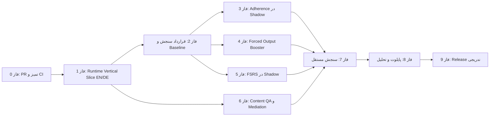

# رودمپ اجرایی اتوماتیک‌شدن زبان و شواهد پژوهشی

**نسخه:** 1.2

**تاریخ:** 2026-08-21  
**دامنه:** English Automaticity و DeutschFlow (فقط این دو اپ — بدون پروژهٔ لیسانس)  
**منبع:** فایل «نقد پداگوژیک، اثرگذاری و محتوا» و وضعیت واقعی مخزن

## تصمیم اصلی

هدف محصول «تمام‌کردن درس» یا افزایش XP نیست. هدف، تولید مستقل، صحیح و روان در
گفتار و نوشتار، بازیابی با تأخیر، اصلاح خطا و انتقال به موقعیت جدید است.

این رودمپ بر چهار اصل بنا شده است:

1. **اول یک vertical slice واقعی، بعد AI و دیتاست.**
2. **Rule Engine دربارهٔ شواهد و ارتقای سطح تصمیم می‌گیرد؛ LLM فقط کمک می‌کند.**
3. **تکمیل تمرین معادل mastery یا automaticity نیست.**
4. **هر ادعای اثرگذاری باید baseline، سنجش مستقل و عدم‌قطعیت داشته باشد.**

این سند جایگزین رودمپ UX نیست. ساده‌سازی منو و برنامهٔ روزانه در
`docs/roadmaps/UX-SIMPLIFICATION-ROADMAP-2026-08-20.md` دنبال می‌شود؛ این
سند مسیر شواهد یادگیری، پایداری استفاده، محتوا و ارزیابی را مشخص می‌کند.

## وضعیت واقعی در نقطهٔ شروع

| بخش | وضعیت 2026-08-21 | مدرک |
|---|---|---|
| هستهٔ مشترک learning-core | در commit `c666175` و Draft PR [#11](https://github.com/Hajimohammadi-KI/APPS_root/pull/11)؛ هنوز merge نشده | `shared/learning-core` |
| SKILL-001 Adherence Core | remote و قابل بازبینی؛ shadow flag پیش‌فرض خاموش؛ هنوز released نیست | `shared/learning-core/src/adherence` |
| تست اختصاصی adherence | تأییدشده در این بررسی: 21 تست، 60,185 assertion | `bun run test:adherence-core` |
| کل تست learning-core | تأییدشده در این بررسی: 27 تست، 60,200 assertion | `bun run test` |
| TypeScript و mirror parity | تأییدشده در این بررسی | `bun run typecheck` و `node sync-workspaces.mjs --check` |
| CI اختصاصی | هر دو workflow روی commit `c666175` سبز؛ review/merge باقی است | [Learning Core run 32505151386](https://github.com/Hajimohammadi-KI/APPS_root/actions/runs/32505151386) و [German run 32505151423](https://github.com/Hajimohammadi-KI/APPS_root/actions/runs/32505151423) |
| اصلاح runtime و مسیرهای آلمانی | Draft PR [#13](https://github.com/Hajimohammadi-KI/APPS_root/pull/13) با CI لینوکس سبز؛ آلمانی‌محور و stacked است، پس به‌تنهایی G1 را نمی‌بندد | [run 32510365622](https://github.com/Hajimohammadi-KI/APPS_root/actions/runs/32510365622) |
| ادغام runtime در هر دو اپ | کامل و مستقل اثبات نشده | **Gate G1 باز است** |
| AI و دیتاست runtime | نباید آغاز شود | وابسته به G1 و G2 |
| اثرگذاری روی زبان‌آموز واقعی | دادهٔ کافی وجود ندارد | **N/A تا اجرای پایلوت** |

> سبزشدن تست‌های pure TypeScript فقط صحت قراردادها و invariants را نشان می‌دهد؛
> این نتیجه، به‌تنهایی اثبات نمی‌کند که کاربر واقعاً زبان را اتوماتیک می‌کند.

## لینک‌های اجرای محلی تأییدشده در 2026-08-21

| سرویس | لینک ویندوز | لینک تبلت/Android در همان Wi-Fi | وضعیت |
|---|---|---|---|
| App Starter | [127.0.0.1:4300](http://127.0.0.1:4300/) | فقط میزبان ویندوز | HTTP 200؛ health سریع و بدون خطای کاذب startup |
| English Automaticity | [127.0.0.1:3202](http://127.0.0.1:3202/) | [192.168.178.24:3202](http://192.168.178.24:3202/) | HTTP 200 و browser smoke test |
| DeutschFlow | [127.0.0.1:3210](http://127.0.0.1:3210/) | [192.168.178.24:3210](http://192.168.178.24:3210/) | HTTP 200 و browser smoke test |
| Cross Repository Tracker | [127.0.0.1:4312](http://127.0.0.1:4312/) | هنوز روی LAN منتشر نشده | HTTP 200 روی ویندوز؛ WSL relay لازم است |

این جدول فقط **دسترس‌پذیری runtime محلی** را ثبت می‌کند و مدرک عبور G1، اثرگذاری
یادگیری یا چرخهٔ انتشار G6 نیست. پس از restart ویندوز، `START-APPS.cmd` باید اجرا
شود؛ اگر IP داخلی WSL تغییر کرده باشد، Windows ممکن است برای اصلاح bridge یک
UAC تأییدشده درخواست کند.

## نقشهٔ وابستگی

فازهای 3، 4، 5 و بخش authoring فاز 6 پس از عبور G1 و G2 می‌توانند در
شاخه‌های جدا پیش بروند؛ هیچ‌کدام نباید در یک PR بزرگ با دیگری ادغام شود.

## دروازه‌های اجباری

| Gate | شرط عبور | اگر عبور نکرد |
|---|---|---|
| **G0 — Source Gate** | چهار مسیر SKILL-001 در PR جدا، review و CI سبز | هیچ فاز وابسته merge نشود |
| **G1 — Runtime Evidence Slice** | یک واحد B1 انگلیسی و یک واحد B1 آلمانی از content تا evidence واقعی عبور کنند | AI، ingestion دیتاست و adaptive decisions متوقف بماند |
| **G2 — Measurement Contract** | event schema، consent، privacy، baseline و data-quality checks تصویب شوند | هیچ ادعای بهبود یا A/B test منتشر نشود |
| **G3 — Shadow Safety** | خروجی جدید در shadow با رفتار فعلی مقایسه شود و دادهٔ کاربر را تغییر ندهد | feature flag خاموش بماند |
| **G4 — Content Quality** | provenance، مجوز، بازبینی انسانی و rubric برای همهٔ آیتم‌های پایلوت | آیتم وارد برنامهٔ روزانه نشود |
| **G5 — Learning Evidence** | pre/post مستقل، delayed recall و novel transfer با دادهٔ واقعی | واژهٔ «automatic» فقط هدف محصول باشد، نه نتیجهٔ اثبات‌شده |
| **G6 — Release Lifecycle** | build، E2E، responsive، Install/Update/Repair و حفظ داده پاس شوند | installer یا نسخهٔ وب منتشر نشود |

> **چرا G1 فقط روی یک سطح (B1) تعریف شده، نه همهٔ سطوح؟** هدف G1 اثبات
> درستی مسیر فنی (pipeline) است، نه پوشش محتوا — سطح فقط metadata روی
> `ContentUnit` است و منطق pipeline را تغییر نمی‌دهد. اگر همزمان با هر شش
> سطح شروع شود، هر باگ ممکن است از معماری باشد یا از محتوای همان سطح —
> قابل تفکیک نیست. B1 هم انتخاب شده چون اولین سطحی است که زبان‌آموز متن
> به‌هم‌پیوسته تولید می‌کند، پس موتور ارزیابی (delayed recall، novel
> transfer، speaking) را واقعی‌تر از A1 زیر فشار می‌گذارد. پس از عبور G1،
> همان مسیر برای A1 تا C2 هم کار می‌کند؛ آنچه می‌ماند نوشتن و بازبینی
> محتوای آن سطوح است — دقیقاً کار فاز 6 و Gate G4، نه یک محدودیت دائمی.

## فاز 0 — تفکیک و merge کردن Vertical Slice 1

**برآورد:** 1 تا 2 روز کاری  
**وضعیت:** commit و Draft PR ساخته شده و CI سبز است؛ review و merge باقی است

**Issue:** [#3 — Local-first adherence core](https://github.com/Hajimohammadi-KI/APPS_root/issues/3)
**PR:** [#11 — Vertical Slice 1 core, mirrors, and CI gate](https://github.com/Hajimohammadi-KI/APPS_root/pull/11) (`c666175`)

فقط این چهار مسیر وارد PR نخست شوند:

1. `shared/learning-core`
2. `Apps/English/English-07082026/packages/learning-core`
3. `Apps/Deutsch-V10.08.2026/packages/learning-core`
4. `.github/workflows/learning-core-adherence-ci.yml`

### خروجی

- یک source of truth و دو mirror قابل کنترل؛
- adherence pure TypeScript، بدون UI، backend، push notification یا LLM؛
- feature flag با پیش‌فرض `false`؛
- CI برای typecheck، تست‌ها، اندازهٔ bundle و mirror parity.

### معیار خروج

- [x] PR مستقل فقط محدودهٔ source/mirrors/CI و lockfileهای workspace لازم را دارد؛
- [x] CI روی PR سبز است؛
- [x] فایل‌های نامرتبط worktree وارد commit نشده‌اند؛
- [ ] review و merge PR #11 انجام شود؛
- [ ] تا پیش از merge، SKILL-001 «remote verified» است، نه «released».

## فاز 1 — Vertical Slice واقعی در English و Deutsch

**برآورد:** 1 sprint  
**وابستگی:** G0  
**هدف:** تبدیل قرارداد pure core به مسیر واقعی یادگیری در هر دو اپ.

### محدوده

- یک واحد authored و human-reviewed در سطح B1 برای هر زبان؛
- مسیر کامل `content → daily plan → learner response → evaluation → evidence → local event`؛
- یک تلاش نوشتاری و یک تلاش گفتاری با صدای واقعی؛
- Conversation Studio با مسیر
  `Listen/Recall → Record → Replay → Review transcript → Correct → Improve → Save`؛
- transcript و evaluation واقعی؛ هیچ پاسخ hard-coded یا demo evidence پذیرفته نیست؛
- رویدادها فقط شناسه و metadata کمینه داشته باشند؛ متن و صوت در analytics event کپی نشود.

### معیار خروج

- E2E برای EN و DE نشان دهد با re-record، evidence قبلی باطل می‌شود؛
- speaking بدون audio معتبر، mastery-eligible نشود؛
- پاسخ اشتباه، completion یا تایمر 60 ثانیه status automatic ندهد؛
- delayed recall و novel transfer به‌صورت event جدا قابل ثبت باشند؛
- خطای provider با وضعیت unavailable دیده شود، نه موفقیت جعلی.

## فاز 2 — قرارداد سنجش، حریم خصوصی و Baseline

**برآورد:** 1 sprint  
**وابستگی:** G1  
**Issues:** [#9 — Independent assessment](https://github.com/Hajimohammadi-KI/APPS_root/issues/9)، [#10 — Learning analytics](https://github.com/Hajimohammadi-KI/APPS_root/issues/10)

### کارها

- نسخه‌گذاری event schema و content schema؛
- تعریف رضایت آگاهانه، retention، export و deletion داده؛
- ثبت baseline قبل از روشن‌کردن هر intervention؛
- جداسازی متریک engagement از learning outcome؛
- بررسی completeness، uniqueness، validity و leakage برای داده‌ها؛
- تعریف rubric انسانی برای گفتار و نوشتار.

### متریک‌های اصلی

| نوع | متریک | تفسیر درست |
|---|---|---|
| تولید | `first_attempt_valid_rate` | تلاش اول بدون hint/model answer |
| گفتار | `time_to_first_valid_speech` | زمان تا اولین صدای ارزیابی‌پذیر، نه تا کلیک Start |
| بازیابی | `delayed_recall_rate` | موفقیت روی محتوای جدا و با تأخیر |
| انتقال | `novel_transfer_rate` | استفادهٔ صحیح در موضوع یا موقعیت تازه |
| اصلاح | `independent_repair_rate` | اصلاح بدون نمایش جواب کامل |
| پایداری | `return_after_gap_rate` | بازگشت پس از وقفه؛ جدا از outcome |
| ایمنی | `false_positive_rate` | نمونهٔ انسانی‌برچسب‌خورده، جدا برای زبان/سطح/دستگاه |

هدف عددی پیش از baseline تعیین نمی‌شود. پس از baseline، target باید همراه با
بازهٔ عدم‌قطعیت و guardrail کیفیت یادگیری تصویب شود.

## فاز 3 — Adherence Engineering در Shadow

**برآورد:** 1 تا 2 sprint  
**وابستگی:** G2  
**Issues:** [#6 — Implementation intentions](https://github.com/Hajimohammadi-KI/APPS_root/issues/6)، [#7 — Guarded nudges](https://github.com/Hajimohammadi-KI/APPS_root/issues/7)

### ترتیب اجرا

1. اتصال SKILL-001 به برنامهٔ 15/30/45 دقیقه فقط در shadow؛
2. ذخیرهٔ اختیاری implementation intention در onboarding؛
3. micro-goal پنج‌دقیقه‌ای برای روزهای کم‌انرژی، بدون حذف کامل productive output؛
4. comeback flow بدون شرم‌دادن یا صفرکردن دستاورد واقعی؛
5. فقط in-app prompt با consent و cooldown؛ push/email در این فاز ممنوع؛
6. مقایسهٔ پیشنهاد shadow با برنامهٔ واقعی، بدون تغییر تجربهٔ کاربر.

### معیار خروج

- خاموش‌کردن flag رفتار قبلی را دقیقاً برگرداند؛
- timezone، چند session در یک روز، gap، freeze و comeback deterministic باشند؛
- هیچ nudge بدون opt-in ظاهر نشود؛
- `nudge → session` جدا از `session → learning gain` گزارش شود؛
- adherence به‌تنهایی mastery یا automaticity نسازد.

## فاز 4 — Forced Output Booster

**برآورد:** 1 تا 2 sprint  
**وابستگی:** G2 و محتوای authored معتبر  
**Issue:** [#4 — Forced-output booster](https://github.com/Hajimohammadi-KI/APPS_root/issues/4)

### طراحی محصول

- 3 تا 6 دور کوتاه 30 تا 60 ثانیه‌ای، پشت feature flag؛
- دورهای Recall، Automate Aloud و Transfer؛
- fallback تایپ برای نبود میکروفون یا نیاز دسترس‌پذیری؛
- برنامهٔ 45 دقیقه‌ای فقط نسخهٔ کشیدهٔ 15 دقیقه‌ای نباشد: گفتار طولانی‌تر،
  نوشتن مستقل و بیش از یک زمینهٔ انتقال داشته باشد؛
- سختی و حجم بر اساس مدت انتخابی تغییر کند، اما سطح فقط با کیفیت شواهد ارتقا یابد.

### معیار خروج

- تلاش واقعی ذخیره شود؛ latency اولین کلمه و self-repair قابل ثبت باشد؛
- واژهٔ کلیدی به‌تنهایی جواب غلط را قبول نکند؛
- Booster قابل ردکردن و flag خاموش باشد؛
- هیچ ادعای «صدها تکرار لازم است» به‌عنوان آستانهٔ جهانی در کد hard-code نشود.

## فاز 5 — مهاجرت FSRS در Shadow

**برآورد:** 1 تا 2 sprint  
**وابستگی:** G2  
**Issue:** [#5 — FSRS shadow migration](https://github.com/Hajimohammadi-KI/APPS_root/issues/5)

### کارها

- نگاشت دادهٔ scheduler فعلی به Difficulty، Stability و Retrievability؛
- محاسبهٔ due date فعلی و FSRS در کنار هم، بدون تغییر برنامهٔ کاربر؛
- ثبت اختلاف زمان‌بندی و rollback metadata؛
- تست property-based برای monotonicity و boundaryها؛
- استفاده از پیاده‌سازی معتبر FSRS؛ نه الگوریتم مبتنی بر `ease factor` و نه
  invariant نامعتبر `stability >= difficulty`.

### معیار خروج

- حداقل یک دورهٔ واقعی shadow بدون از دست‌رفتن review history؛
- migration رفت‌وبرگشت‌پذیر و idempotent؛
- فعال‌سازی تدریجی فقط پس از بررسی retention، workload و overdue burden.

## فاز 6 — Content QA، Mediation و پایلوت دیتاست

**برآورد:** 2 تا 3 sprint  
**وابستگی:** G1؛ ingestion runtime وابسته به G2 و G4  
**Issue:** [#8 — CEFR mediation pilot](https://github.com/Hajimohammadi-KI/APPS_root/issues/8)

### ContentUnit مشترک

هر واحد باید language، CEFR، version، source/license، reviewer status و حداقل
یکی از modeهای recognition، writing، speaking، repair، transfer یا mediation
را داشته باشد. شناسهٔ فنی خودکار تولید شود؛ مدرس مجبور به واردکردن context key
نباشد.

### پایلوت Mediation

- ابتدا B1، برای هر زبان یک مجموعهٔ کوچک guided و independent؛
- خلاصه‌کردن، بازگویی، توضیح برای مخاطب دیگر و انتقال اطلاعات؛
- Reception، Production، Interaction و Mediation جدا گزارش شوند؛
- rubric و نمونهٔ anchor توسط بازبین انسانی تأیید شود.

### دیتاست‌های نامزد پس از Gate

| منبع | استفادهٔ مجاز | استفادهٔ غیرمجاز |
|---|---|---|
| Tatoeba CC0 | candidate متن کوتاه پس از QA | ورود خودکار صوت یا جملهٔ تأییدنشده |
| Common Voice | robustness ترنسکریپت EN/DE | نمرهٔ قطعی تلفظ زبان‌آموز |
| FLEURS | benchmark ثابت ASR | محتوای آموزشی یا mastery evidence |
| MERLIN | نمونهٔ خطای واقعی آلمانی و CEFR | استفاده بدون رعایت CC BY-SA |
| UD English EWT / German GSD | ویژگی نحوی کمکی | ادعای CEFR یا خطای زبان‌آموز |
| W&I + LOCNESS / C4 200M GEC | پژوهش GEC پس از بررسی مجوز | seed مستقیم Installer یا evidence تسلط |

دانلود حجیم، fine-tune و افزودن داده به installer تا عبور G1/G2/G4 انجام
نمی‌شود. کاتالوگ metadata-only به معنی «دیتاست استفاده‌شده در مدل» نیست.

### معیار خروج

- 100٪ آیتم‌های پایلوت provenance، مجوز و version داشته باشند؛
- نمونه‌گیری طبقه‌بندی‌شده و دو بازبین مستقل برای naturalness و CEFR alignment؛
- هیچ آیتم QA-failed در برنامهٔ روزانه schedule نشود؛
- محتوای درس همچنان authored و teacher-reviewed بماند.

## فاز 7 — سنجش مستقل automaticity

**برآورد:** 1 تا 2 sprint برای ابزار، سپس اجرای مطالعه  
**وابستگی:** G3 و G4  
**Issue:** [#9 — Independent assessment](https://github.com/Hajimohammadi-KI/APPS_root/issues/9)

### پروتکل

- pre-test و post-test جدا از محتوای تمرین روزانه؛
- تلاش اول بدون دیدن جواب، سپس delayed recall و novel transfer؛
- speaking با audio واقعی و writing با متن مستقل؛
- دو ارزیاب یا adjudication برای نمونهٔ اختلاف‌دار؛
- گزارش سطح زبان، زمان تمرین 15/30/45، دستگاه و شرایط provider؛
- C-test فقط شاخص کمکی proficiency عمومی است، نه مدرک automaticity؛
- IRT فقط پس از calibration نمونه و بررسی fit استفاده شود.

### معیار خروج

- rubric و scorer agreement مستند؛
- false positive/negative با مجموعهٔ انسانی‌برچسب‌خورده؛
- retention بعد از تأخیر سنجیده شود؛
- نتیجه با confidence interval و محدودیت‌ها گزارش شود، نه درصد قطعی تبلیغاتی.

## فاز 8 — پایلوت رضایت‌محور و Analytics

**برآورد:** 4 تا 8 هفته جمع‌آوری داده پس از آماده‌شدن ابزار  
**وابستگی:** G5  
**Issue:** [#10 — Learning analytics](https://github.com/Hajimohammadi-KI/APPS_root/issues/10)

### طراحی پایلوت

- ابتدا internal، سپس cohort کوچک با رضایت آگاهانه؛
- rollout ترتیبی: control → shadow → opt-in intervention؛
- گزارش جداگانه برای EN/DE و برنامه‌های 15/30/45 دقیقه؛
- attrition و missing data به‌عنوان نتیجه گزارش شوند، نه حذف شوند؛
- اگر فقط یک کاربر یا یک دستگاه وجود دارد، فقط descriptive local analytics
  مجاز است؛ Kaplan-Meier، AUC یا ادعای cohort ساخته نمی‌شود.

### تصمیم Go/No-Go

Intervention فقط وقتی گسترش می‌یابد که:

- learning outcome بدتر نشده باشد؛
- false positive افزایش معنادار نداشته باشد؛
- completion صرف، علت ظاهری موفقیت نباشد؛
- consent، export و deletion کار کنند؛
- اثر برای حداقل یکی از delayed recall یا novel transfer دیده شود.

## فاز 9 — انتشار تدریجی وب، PWA و Windows

**برآورد:** در پایان هر بستهٔ تغییر substantive  
**وابستگی:** G6

برای هر دو اپ، Definition of Done انتشار شامل موارد زیر است:

- typecheck، lint، unit/integration و E2E؛
- تست real runtime و HTTP، نه فقط build؛
- Windows، تبلت و Android browser در viewportهای بحرانی؛
- reflow در 320px، keyboard focus، Screen Reader، target حداقل 44×44 و
  `prefers-reduced-motion`؛
- LTR برای انگلیسی/آلمانی، RTL برای فارسی و `dir="auto"` برای محتوای متغیر؛
- Offline/PWA و recovery پس از قطع شبکه؛
- بازسازی Install/Update/Repair و payload؛
- fresh install، startup، update، repair، uninstall و حفظ دادهٔ کاربر؛
- گزارش نسخه، مسیر دقیق installer و checksum؛
- microphone و provider خارجی که واقعاً آزموده نشده‌اند با `N/A` یا `BLOCKED`
  گزارش شوند.

## ترتیب PRها و Issueها

| ترتیب | محدوده | Issue | شرط شروع |
|---:|---|---|---|
| 1 | Adherence core + mirrors + CI | [#3](https://github.com/Hajimohammadi-KI/APPS_root/issues/3) | اکنون، پس از جداسازی worktree |
| 2 | Runtime evidence slice EN/DE | issue جدا ایجاد شود | merge شدن #3 |
| 3 | Measurement contracts و local export | [#10](https://github.com/Hajimohammadi-KI/APPS_root/issues/10) | G1 |
| 4 | Implementation intentions | [#6](https://github.com/Hajimohammadi-KI/APPS_root/issues/6) | G2 |
| 5 | Guarded in-app nudges | [#7](https://github.com/Hajimohammadi-KI/APPS_root/issues/7) | #6 و consent |
| 6 | Forced-output booster | [#4](https://github.com/Hajimohammadi-KI/APPS_root/issues/4) | G2 و authored content |
| 7 | FSRS shadow migration | [#5](https://github.com/Hajimohammadi-KI/APPS_root/issues/5) | G2 |
| 8 | Mediation pilot + QA | [#8](https://github.com/Hajimohammadi-KI/APPS_root/issues/8) | G1 و content schema |
| 9 | Independent assessment | [#9](https://github.com/Hajimohammadi-KI/APPS_root/issues/9) | G3 و G4 |
| 10 | Consented pilot analytics | [#10](https://github.com/Hajimohammadi-KI/APPS_root/issues/10) | G5 و دادهٔ چندکاربره |

## کارهایی که فعلاً نباید انجام شوند

- ساخت مدل بزرگ یا fine-tune قبل از vertical slice و baseline؛
- دانلود انبوه دیتاست یا قراردادن آن در installer؛
- استفاده از LLM/ASR برای تصمیم نهایی mastery؛
- default-on کردن Booster، Nudges یا FSRS؛
- ارسال push/email بدون consent و scheduler قابل‌اعتماد؛
- محاسبهٔ cohort survival از یک کاربر یا یک دستگاه؛
- استفاده از completion، XP، تایمر یا keyword match به‌عنوان proof؛
- PR بزرگ شامل چند skill، تغییر UI، دیتاست و backend؛
- انتشار نسخه بدون چرخهٔ Install/Update/Repair و حفظ داده.

## Definition of Done کل برنامه

رودمپ فقط زمانی به هدف می‌رسد که همهٔ موارد زیر شواهد قابل بازبینی داشته باشند:

- مسیر واقعی speaking و writing در هر دو زبان؛
- delayed recall، novel transfer و independent repair؛
- محتوای natural، CEFR-aligned، دارای provenance و human review؛
- adherence intervention با رضایت، rollback و جداسازی outcome از engagement؛
- ارزیابی مستقل pre/post و retention؛
- عدم‌قطعیت و محدودیت‌ها در گزارش؛
- parity انگلیسی/آلمانی، دسترس‌پذیری و responsive بودن؛
- PWA و Windows installer با حفظ داده؛
- هیچ critical journey آزموده‌نشده‌ای با عنوان `VERIFIED` گزارش نشود.

## اقدام بعدی واحد

**فقط review و merge فاز 0 را کامل کنید:** Draft PR [#11](https://github.com/Hajimohammadi-KI/APPS_root/pull/11)
را بازبینی و merge کنید. سپس PR آلمانی [#13](https://github.com/Hajimohammadi-KI/APPS_root/pull/13)
را روی base نهایی بازبینی کنید و یک issue مستقل برای Runtime Evidence Slice
کامل انگلیسی/آلمانی باز کنید. تا عبور آن slice، AI، دیتاست runtime و rollout
یادگیری متوقف می‌مانند.
