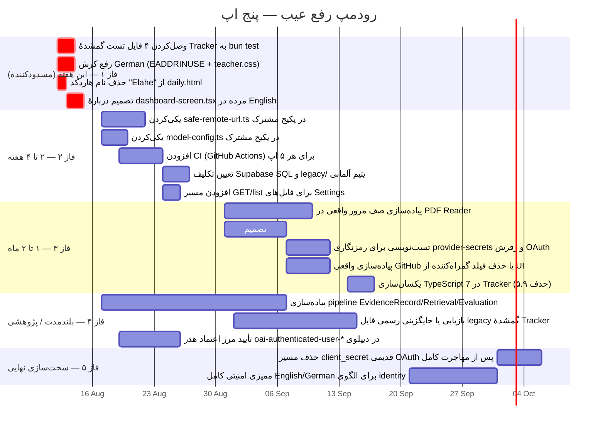

# نقد برنامه‌ها و رودمپ رفع عیب — ۲۰۲۶-۰۸-۱۲

## دامنه و روش

این سند بر پایهٔ بررسی مستقیم کد پنج اپ (نه فقط خواندن مستندات موجود) تهیه شده: English Automaticity، German Automaticity، Cross Repository Tracker، PDF Reader، و Settings. نقشهٔ راه قبلی (`ACTUAL-SOFTWARE-ROADMAP-2026-08-11.md`) و گزارش امنیتی قبلی (`SECURITY-EVALUATION-2026-08-12.md`) پیش‌فرض گرفته می‌شوند و در اینجا تکرار نمی‌شوند؛ این سند فقط یافته‌های **جدید و مشخص‌تر** را اضافه می‌کند — با فایل و خط.

نتیجهٔ کلی: وضعیت بدتر از چیزی است که مستندات موجود ادعا می‌کردند. حداقل دو مورد از یافته‌های زیر مستقیماً ادعاهای سند امنیتی دیروز را نقض می‌کنند.

---

## ۱. English Automaticity

| جنبه | وضعیت |
| --- | --- |
| CI | هیچ پایپ‌لاین CI در کل مونوریپو وجود ندارد؛ همهٔ چک‌ها فقط محلی‌اند |
| آخرین اجرای تست | **fail** — `test-results/artifacts/.last-run.json` |

**مشکل جدی:** `apps/web/features/screens/dashboard-screen.tsx` (۸۵۰ خط، عنوان "Use English confidently and automatically") در هیچ‌جای کد import نمی‌شود — کد مرده است. `app-shell.tsx:30,506` به‌جای آن `DashboardV2Screen` ("Good morning, Learner") را رندر می‌کند. اما `tests/e2e/app.spec.ts:56-64` و `tests/e2e/automaticity.spec.ts:26,72` همچنان روی متن قدیمی (`"Automaticity Mission"`, `"Daily Training"`) اسرت می‌زنند — یعنی تست‌ها روی کد مرده اجرا می‌شوند و شکست ثبت‌شده در `.last-run.json` دقیقاً همین‌جاست.

**سومین UI موازی:** `tests/e2e/current-daily-practice.spec.ts` یک UI کاملاً سوم را انتظار دارد که از `apps/web/public/replacements/en/daily.html` می‌آید — یک صفحهٔ استاتیک که با `next.config.ts:14-19` مسیر `/daily` را بای‌پس می‌کند. این فایل نام شخصی را هاردکد کرده: **`"Good morning, Elahe"` در خط ۳۱** — نه شخصی‌سازی واقعی، بلکه متن ثابت در مارک‌آپ ارسالی به هر کاربر.

نتیجه: سه پیاده‌سازی موازی داشبورد روزانه (یکی مرده، یکی زنده، یکی استاتیک با نام هاردکد) — بدهی فوری.

مثبت: حلقهٔ یادگیری اصلی (`legacy-parity.spec.ts:148-156`, `automaticity.spec.ts`) واقعاً با localStorage کار می‌کند، مصنوعی نیست. مصرف هدر هویتی محدود به انتخاب کلید provider است (`api/ai/route.ts:9-15`).

---

## ۲. German Automaticity

| جنبه | وضعیت |
| --- | --- |
| اسکریپت `verify` جدا (فرمت/lint/typecheck/تست/بیلد) | سبز، ۷۲+ تست پاس |
| اجرای واقعی dev stack | **کرش می‌کند** |

**تناقض:** `.codex-release-verify.log` (۱۱ اوت، ۱۰:۲۶) سبز است، اما `runtime-german.log:35-108` (همان روز، ساعت ۱۵:۰۲ — دیرتر) نشان می‌دهد سرور API با `EADDRINUSE` روی پورت ۴۲۱۰ (دقیقاً همان ریسک «سرور تکراری/کهنه» که نقشهٔ راه قبلی هشدار داده بود) و Next/Turbopack با پنیک روی `./styles/pages/teacher.css` کرش کرده و به `GET / 500` ختم شده. یعنی «تست‌ها و بیلد پاس می‌شوند» فقط دربارهٔ اسکریپت ایزوله‌شدهٔ verify صادق است، نه یک session واقعی توسعه.

**مصنوعات یتیم:** `supabase/migrations/...sql` (۱۳۷۹ خط) و `supabase/seed.sql` (۲۱٬۲۱۹ خط!) وجود دارند، اما هیچ `createClient`/`@supabase` در `apps/` استفاده نمی‌شود — این فایل‌ها کاملاً مرده‌اند و صرفاً حجم و ابهام اضافه می‌کنند.

English و German عمداً کد مشترک ندارند (parity با اسکریپت diff بین دو ریپو کنترل می‌شود، نه با کامپوننت مشترک) — یک تصمیم معماری، نه بدهی، اما یعنی هر باگ باید دوبار فیکس شود.

مثبت: حلقهٔ یادگیری واقعاً پیاده شده (`automaticity-lab.tsx:628-646`, `review-center.tsx:64-186` با فاصله‌گذاری واقعی مرور).

---

## ۳. Cross Repository Tracker — بزرگ‌ترین یافتهٔ این دور

### ۳.۱ تست‌های امنیتی دیروز واقعاً اجرا نمی‌شوند

`package.json:27` اسکریپت `test` را صراحتاً روی ۷ فایل از ۱۱ فایل `.test.ts` محدود کرده. **چهار فایل واقعی هرگز در `bun test` اجرا نمی‌شوند:**
- `tests/safe-remote-url.test.ts` (۱۱۸ خط، همان ۱۳ تستی که در گزارش امنیتی دیروز به‌عنوان پوششِ فیکس SSRF ذکر شد)
- `tests/recall-scheduler.test.ts` (۷۵ خط)
- `tests/article-reading-order.test.ts`
- `tests/project-schedule.test.ts`

این یافته **مستقیماً بند ۳ گزارش امنیتی دیروز را تشدید می‌کند**: نه‌تنها CI خودکاری وجود ندارد، بلکه حتی اجرای دستی استاندارد (`bun test`) این تست‌ها را لمس نمی‌کند. فیکس SSRF کد درستی دارد (بررسی دستی تأیید کرد)، اما هیچ گیت خودکاری از رگرسیون آن جلوگیری نمی‌کند.

### ۳.۲ بدهی TypeScript تأیید شد

`package.json:66-67`: هر دو `"typescript": "5.9.3"` و `"typescript7": "npm:typescript@7.0.2"` نصب‌اند؛ `typecheck` صراحتاً `typescript7` را صدا می‌زند اما `eslint-config-next/typescript` همچنان به ۵.۹ وابسته است — دو کامپایلر هم‌زمان فعال، مشخص نیست کدام مرجع است.

### ۳.۳ فایل legacy گم‌شده — خودِ اپ هم تأیید می‌کند

هیچ نسخه‌ای از `StudyPlan_Cross_Repository_Code_Intelligence_V6_3_1.html` در کل `D:\APPS_root` (یا مسیرهای احتمالی دیگر) پیدا نشد. خودِ `docs/RECOVERED-LEGACY-INVENTORY.md:40-53` این را تأیید و نتیجه‌گیری می‌کند: «تطابق legacy... غیرقابل‌اثبات» تا این فایل بازیابی شود.

### ۳.۴ نام‌گذاری گمراه‌کننده — پایپ‌لاین تز عملاً پیاده نشده

`db/schema.ts` (۱۴۸ خط) فقط جدول‌های tracker/productivity دارد (`taskProgress`, `dayNotes`, `pdfStudySessions`, ...) — **صفر جدول** برای EvidenceRecord، retrieval، یا evaluation. `apps/api/src` فقط ماژول‌های `health`/`integrations`/`database` دارد. خودِ `docs/NLP-RETRIEVAL-LAB.md` (فارسی) کل پایپ‌لاین ادعایی را «کار آینده، برنامه‌ریزی‌شده ۱۷ اوت تا ۷ سپتامبر ۲۰۲۶» اعلام می‌کند و صراحتاً می‌گوید اگر تا ۷ سپتامبر کامل نشود، «Lab مستقل می‌ماند».

نتیجه: چیزی که امروز اجرا می‌شود یک ابزار شخصی مطالعه/PDF است (`app/study-tracker.tsx`، ۳۵۶۷ خط)، نه «Cross Repository Code Intelligence». نام اپ ادعایی بزرگ‌تر از پیاده‌سازی واقعی است.

---

## ۴. PDF Reader

| ویژگی هدف (فاز ۴ نقشهٔ راه) | وضعیت واقعی |
| --- | --- |
| باز کردن فایل دقیق درخواستی | ✅ واقعی (`app/page.tsx:362-384`) |
| حفظ موقعیت خواندن | ⚠️ فقط `localStorage`؛ `db/schema.ts` این اپ خالی است («وقتی سایت واقعاً به دیتابیس نیاز داشت جدول اضافه کن») — بدون سینک بین دستگاه‌ها |
| یادداشت/حاشیه‌نویسی/خروجی | ✅ واقعی (`lib/pdf-marks.ts`, export به Word/Excel/تصویر/فلش‌کارت) |
| صف مرور (review queue) | ❌ پیاده نشده — تنها چیزی که هست `reviewDailyNotes()` (`app/page.tsx:869-874`) صرفاً به تب یادداشت‌ها سوییچ می‌کند و کلید session یک اپ دیگر را می‌خواند؛ نه spaced-repetition، نه صف واقعی |

اتصال عجیب: `api/ai/route.ts` و `api/translate/route.ts` این اپ به `CENTRAL_STUDY_APP_URL` (پیش‌فرض ۴۳۱۲ = Tracker) پراکسی می‌شوند، نه به Settings-APP (۴۳۲۳) — یعنی PDF Reader هرگز از سیستم سکرت رمزنگاری‌شدهٔ Settings استفاده نمی‌کند، با اینکه هر دو در یک «کتابخانهٔ یکپارچه‌سازی» هستند.

---

## ۵. Settings App

- Google/OpenAI/DeepL واقعاً تست می‌شوند (`lib/provider-tests.ts:15-56`، `google-provider.ts:73-104` با تماس واقعی API) و سکرت‌ها با AES-256-GCM/HKDF در D1 رمز می‌شوند (`provider-secrets.ts:78-110`) — نقطهٔ قوت واقعی.
- **GitHub یک provider مدیریت‌شده نیست** — فقط یک فیلد متنی آزاد (نام/URL پروژه) در `settings-hub.tsx:19-23,208-236` است؛ هیچ OAuth، ذخیرهٔ توکن، یا health-check برای GitHub وجود ندارد، برخلاف تصور ضمنی از UI.
- `app/api/files/route.ts:4-21` فقط POST/آپلود دارد — **هیچ مسیر GET/list/download برای فایل‌های آپلودشده وجود ندارد.** فایل بالا می‌رود اما هیچ راهی برای پس‌گرفتنش از طریق API نیست.
- پوشش تست نازک: تنها یک فایل تست (`tests/werkzeug-settings.test.ts`, ۴۲ خط) در کل اپ؛ منطق رمزنگاری/دیرمزنگاری `provider-secrets.ts` و رفرش OAuth در `google-provider.ts` هیچ تستی ندارند.
- تکرار کد دوم (فراتر از `safe-remote-url.ts`): `lib/model-config.ts` بین Settings و PDF Reader کپی شده، فقط با یک کامنت متفاوت.

---

## جمع‌بندی نقد

بدترین الگوی تکرارشونده در هر پنج اپ: **مستندات/اسکریپت‌های «سبز» یک لایه بالاتر از واقعیت اجرا هستند.** English تستِ کد مرده را پاس نمی‌کند و این را نشان می‌دهد؛ German یک اسکریپت verify سبز دارد در حالی‌که dev واقعی کرش می‌کند؛ Tracker تست‌های امنیتی نوشته‌شده را اصلاً صدا نمی‌زند؛ PDF Reader و Settings ویژگی‌هایی را در مستندات/UI ضمنی می‌کنند (صف مرور، GitHub، سینک بین‌دستگاهی) که پیاده نشده‌اند.

---

## رودمپ رفع عیب

### فاز ۱ — این هفته (مسدودکننده، باید همین الان)
1. چهار فایل تست بی‌صاحب Tracker (`safe-remote-url`, `recall-scheduler`, `article-reading-order`, `project-schedule`) را به اسکریپت `test` در `package.json` اضافه کنید — در غیر این صورت فیکس امنیتی دیروز عملاً بدون گیت رگرسیون است.
2. علت `EADDRINUSE` روی ۴۲۱۰ و پنیک `teacher.css` در German را ریشه‌یابی و رفع کنید؛ اسکریپت `verify` را طوری تغییر دهید که یک اجرای dev واقعی را هم بررسی کند، نه فقط بیلد ایزوله.
3. `"Good morning, Elahe"` را از `public/replacements/en/daily.html` حذف و به یک placeholder عمومی یا مقدار پویا تبدیل کنید.
4. دربارهٔ `dashboard-screen.tsx` تصمیم بگیرید: یا آن را به‌عنوان مسیر فعال وصل کنید یا حذفش کنید و تست‌های E2E (`app.spec.ts`, `automaticity.spec.ts`) را به UI فعلی (`DashboardV2Screen`) بازنویسی کنید.

### فاز ۲ — ۲ تا ۴ هفته (بدهی معماری)
- `safe-remote-url.ts` و `model-config.ts` را از دو/سه کپی به یک پکیج مشترک workspace منتقل کنید.
- یک پایپ‌لاین CI حداقلی (حتی فقط lint+typecheck+test) برای هر پنج اپ اضافه کنید — در حال حاضر صفر است.
- دربارهٔ `supabase/migrations` و `legacy/v20.8-static` در German تصمیم صریح بگیرید: آرشیو رسمی یا حذف، نه رها کردن به‌عنوان کد مرده.
- مسیر GET/list برای فایل‌های آپلودشده در Settings اضافه کنید (در حال حاضر آپلود یک‌طرفه است).

### فاز ۳ — ۱ تا ۲ ماه (تکمیل ویژگی)
- صف مرور واقعی در PDF Reader پیاده کنید یا در README/UI صراحتاً بگویید که فعلاً فقط لینک به یادداشت‌هاست.
- تصمیم بگیرید موقعیت خواندن باید بین دستگاه‌ها سینک شود یا خیر؛ اگر بله، جدول Drizzle واقعی اضافه کنید (فعلاً خالی است).
- تست برای رمزنگاری سکرت و رفرش توکن گوگل بنویسید — این دو مسیر بحرانی‌ترین کد امنیتی سیستم‌اند و صفر پوشش تست دارند.
- GitHub را یا واقعاً به‌عنوان provider با OAuth پیاده کنید یا فیلد فعلی را در UI به‌وضوح «فقط یادداشت متنی، نه اتصال» برچسب بزنید.
- Tracker را روی TypeScript 7 یکسان کنید و `typescript@5.9.3` را حذف کنید.

### فاز ۴ — بلندمدت / پژوهشی
- پایپ‌لاین واقعی EvidenceRecord → Retrieval → Answerability → Evaluation را طبق برنامهٔ خودِ `NLP-RETRIEVAL-LAB.md` (۱۷ اوت تا ۷ سپتامبر) پیش ببرید، یا اگر تاریخ رد شد، نام‌گذاری اپ («Cross Repository Code Intelligence») را با scope واقعی («Study & PDF Tracker») هماهنگ کنید تا مستندات گمراه‌کننده نباشند.
- فایل legacy گم‌شدهٔ Tracker را بازیابی کنید یا `RECOVERED-LEGACY-INVENTORY.md` را به‌عنوان مرجع رسمی نهایی تصویب کنید تا این ابهام برای همیشه بسته شود.
- مرز اعتماد هدر `oai-authenticated-user-*` را — طبق فاز ۰ گزارش امنیتی دیروز — به‌صورت مستند تأیید کنید.

### فاز ۵ — سخت‌سازی نهایی
- پس از اطمینان از مهاجرت کامل به PKCE، مسیر `client_secret` قدیمی گوگل را حذف کنید.
- English و German را برای همان کلاس باگ «دور زدن هویت» که در Settings پیدا و رفع شد ممیزی کنید (فعلاً فقط مصرف هدر برای انتخاب کلید provider تأیید شده، نه کل سطح API).
