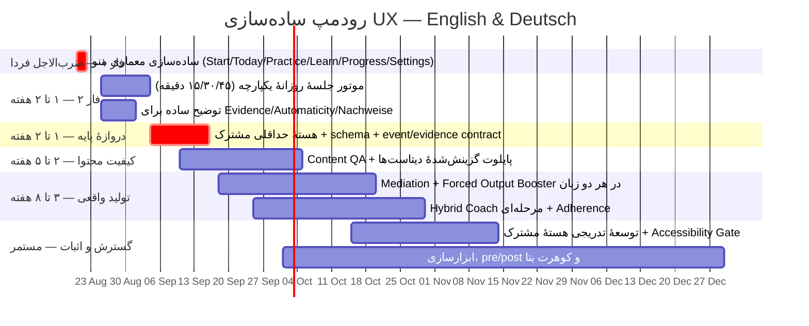

# رودمپ ساده‌سازی تجربهٔ کاربری — English & Deutsch — ۲۰۲۶-۰۸-۲۰

## وضعیت این سند

سند زنده است. هر بار که تغییری در کد `Apps/English/English-07082026` یا
`Apps/Deutsch-V10.08.2026` مرتبط با یکی از فازهای زیر انجام شود، وضعیت همان
فاز در این فایل و در نسخهٔ تصویری آن به‌روز می‌شود — نه فقط توضیح داده می‌شود.
نسخهٔ تصویری: `docs/reports/ux-simplification-roadmap-visual.html` (منتشرشده
به‌عنوان Artifact، همان لینک با هر آپدیت دوباره deploy می‌شود).

نمادهای وضعیت: ⬜ شروع‌نشده · 🟡 در حال انجام · ✅ انجام‌شده · 🔴 مسدود

## منشأ

این رودمپ از سه منبع مستقل ترکیب شده:

1. نقد Codex (۲۰۲۶-۰۸-۲۰) — بررسی بصری با اسکرین‌شات از هر دو اپ
   (`artifacts/dropdown-menu-audit-20260820/`)، شناسایی Conversation
   Studio به‌عنوان گیج‌کننده‌ترین بخش، و پیشنهاد اولیهٔ معماری منو + موتور
   جلسهٔ روزانه + فهرست دیتاست.
2. نقد Claude (همین گفتگو) — بررسی مستقیم کد
   (`packages/content/src`, صفحات `apps/web/app`, CSS لایه‌ای) که نشان داد
   مشکل مشترک هر دو اپ (و Tracker) رشد افزایشی ابعاد وضعیت/صفحه/محتوا بدون
   بازطراحی دوره‌ای است، و کد مشترک واقعی بین English/Deutsch صفر است
   (فقط با `shared/check-duplicated-files.mjs` کنترل می‌شود).
3. فایل «نقد پداگوژیک، اثرگذاری و محتوا» (ارائه‌شده توسط کاربر) — تأکید بر
   شکاف Mediation در CEFR Companion Volume، کمبود دوز گفتاری در برنامهٔ
   ۱۵ دقیقه‌ای، نیاز به بازبینی مستقل کیفیت محتوا، اندازه‌گیری pre/post و
   مهندسی پایداری استفاده. کدهای نمونهٔ این فایل پیشنهاد معماری‌اند و تا
   وقتی در مخزن پیاده و آزموده نشوند «قابلیت موجود» محسوب نمی‌شوند.

## نقشهٔ فازها

---

## فاز ۰ — نقد پایه (✅ انجام‌شده، ۲۰۲۶-۰۸-۲۰)

بررسی بصری (Codex) + بررسی کد (Claude) کامل شد. یافتهٔ مشترک: مشکل اصلی رنگ
یا زیبایی نیست، تعداد انتخاب‌ها و تکرار تصمیم‌هاست. Conversation Studio
گیج‌کننده‌ترین صفحه است چون فیلتر/حالت/مرحله/آمار هم‌زمان دیده می‌شوند و
طراحی‌اش با بقیهٔ اپ فرق دارد.

## فاز ۱ — ساده‌سازی معماری منو ✅ (کامل شد ۲۰۲۶-۰۸-۲۱ ~۰۰:۲۰)

Codex بخش اصلی را پیاده کرد (CTA واحد در Home، رفع «دو Sidebar» در
Conversation Studio). Claude باقیمانده را کامل کرد: **Today's Practice /
Heutiges Training** از داخل گروه «Practice» بیرون آورده شد و کنار Home به‌صورت
دکمهٔ دائمی نمایش داده می‌شود (هم Desktop هم Mobile، هر دو اپ)، و ۴ گروه منو
نام‌گذاری ساده شدند: **Practice / Learn / Progress / Settings**
(Praxis / Lernen / Fortschritt / Einstellungen در آلمانی). تأیید با
typecheck + test واقعی + اسکرین‌شات از dev serverهای زندهٔ هر دو اپ
(localhost:3201 و localhost:3210). جزئیات: `docs/roadmaps/PHASE-1-HANDOFF-2026-08-20.md`.

**بدون داده جدید، کمترین ریسک.** بازآرایی ناوبری هر دو اپ به:

1. Start / Startseite — همیشه بیرون از Dropdown
2. Today / Heute
3. Practice ▼ (Mixed Training · Conversation Studio · Review)
4. Learn ▼ (Grammar · Vocabulary · PDF Reader)
5. Progress ▼ (Learning Evidence · Repair Items · Statistics)
6. Settings ▼

دکمهٔ Home در همهٔ صفحات در دسترس باشد. معیار پذیرش: در Home فقط یک CTA
غالب دیده شود، نه چند دکمهٔ شروع رقیب.

## فاز ۲ — موتور جلسهٔ روزانهٔ یکپارچه ✅ (تصحیح ۲۰۲۶-۰۸-۲۰ ~۰۰:۱۵)

**تصحیح یک اشتباه قبلی:** در پیام قبلی گفته شد تخصیص per-بخش پیاده نشده —
این نادرست بود، بدون خواندن فایل نتیجه‌گیری شده بود. بعد از خواندن واقعی
`apps/web/lib/adaptive-daily-plan.ts` (English) و معادل آن در
`packages/domain` (Deutsch، به‌صورت پکیج مشترک `@grammar/domain` بین
کامپوننت‌های خود همان اپ): تخصیص دقیقه/تعداد آیتم per-بخش کاملاً پیاده و
تست‌شده است (`adaptive-daily-plan.test.ts` سبز، جزو تست‌هایی که در تأیید
فاز ۱ اجرا شد). عدد سه بخش (Mixed Practice، Conversation Studio،
Automatization) دقیقاً با جدول این رودمپ یکی است؛ Grammar و Review به‌جای
یک ستون ترکیبی، دو بخش جدا نگه داشته شده‌اند — تفاوت مفهومی جزئی، نه نقص.

بعد از انتخاب زمان (۱۵/۳۰/۴۵ دقیقه)، کاربر دیگر بین Grammar/Studio/Review/
Mixed تصمیم نگیرد؛ موتور برنامه بر اساس جدول زیر جلسه را بسازد:

| بخش روزانه | ۱۵ دقیقه | ۳۰ دقیقه | ۴۵ دقیقه |
|---|---:|---:|---:|
| Wiederholen / Recall | ۳ | ۵ | ۷ |
| Mixed Training | ۳ | ۶ | ۱۰ |
| Conversation Studio | ۴ | ۸ | ۱۲ |
| Grammar & Repair | ۲ | ۵ | ۷ |
| Transfer به موقعیت جدید | ۳ | ۶ | ۹ |
| مجموع | ۱۵ | ۳۰ | ۴۵ |

نسخهٔ ۴۵ دقیقه‌ای فقط کشیده‌شدهٔ نسخهٔ ۱۵ دقیقه‌ای نباشد — گفتار طولانی‌تر،
نوشتن مستقل، دو زمینهٔ جدید. ارتقای سطح بر پایهٔ کیفیت شواهد باشد نه تعداد
دقیقه/XP.

> **تصحیح پداگوژیک:** کامل‌بودن پیاده‌سازی به معنی اثبات اثرگذاری نیست.
> برنامهٔ ۱۵ دقیقه‌ای فقط ۴ دقیقه Conversation Studio دارد؛ این دوز برای
> «قابل‌استفاده‌شدن» مفید است اما برای ادعای automaticity کافی و مستقل
> اعتبارسنجی نشده است. فاز ۶ یک Forced Output Booster کوتاه و زمان‌دار را
> اضافه می‌کند و اثر آن باید با سنجش pre/post و retention مقایسه شود.

## فاز ۳ — توضیح ساده برای اصطلاحات فنی ✅ (کامل شد ۲۰۲۶-۰۸-۲۱ ~۰۰:۴۰)

بررسی کد نشان داد English از قبل یک glossary کامل hover-help دارد
(`features/components/contextual-hover-help.tsx`) که به‌صورت خودکار روی هر
متنی که کلماتی مثل evidence/automaticity/mastery/coverage/accuracy دارد
تعریف ساده نشان می‌دهد — این چیزی است که از روی اسکرین‌شات (نقد Codex) قابل
تشخیص نبود چون hover در تصویر ثابت دیده نمی‌شود. Deutsch معادل این سیستم را
دارد (`german-hover-help.tsx`) ولی فقط برای اصطلاحات گرامری (Kasus و...)؛
**"Nachweise" دقیقاً همان کلمه‌ای بود که Codex اسمش را برد و واقعاً در
glossary آلمانی نبود.** اضافه شد: `Nachweis(e)`، `Beherrschung`، `Abdeckung`،
`Genauigkeit` — ترجمهٔ همان تعریف‌های انگلیسی، برای هماهنگی دو اپ.
typecheck + test اپ Deutsch سبز.

## فاز ۴ — Foundation Gate مشترک ⬜

**اثر برای زبان‌آموز:** رفتار پایهٔ هر دو اپ یکسان می‌شود؛ دادهٔ یادگیری،
محتوا و شواهد بین صفحات گم یا متناقض نمی‌شوند.

**کار فنی:** یک `packages/learning-core` حداقلی، نه استخراج بزرگ و یک‌باره:

- schema مشترک `ContentUnit` شامل CEFR، منبع/مجوز، نسخه، وضعیت بازبینی و
  recognition/recall/speaking/writing/repair/transfer/mediation؛
- قرارداد typed برای `DomainEvents` و `EvidenceRecord`؛
- registry اعتبارسنجی Zod/JSON و اجرای آن در CI؛
- قرارداد instrumentation پیش از ادغام runtime دیتاست یا AI در محصول؛
- baseline دسترس‌پذیری در Definition of Done هر PR، نه یک فاز انتهایی.

**وابستگی:** این فاز دروازهٔ اجباری برای **ادغام runtime** و تصمیم‌های یادگیری
در فازهای ۵ تا ۹ است. بررسی read-only منبع و مجوز، ساخت manifest/schema و seed
آزمایشی کوچک و قابل‌برگشت می‌تواند هم‌زمان انجام شود؛ اما دانلود حجیم، آموزش یا
fine-tune، ingestion در محصول، ارسال دادهٔ زبان‌آموز به provider و هر تصمیم
mastery مبتنی بر AI تا عبور vertical slice ممنوع است.

**معیار پذیرش:** یک واحد B1 انگلیسی و یک واحد B1 آلمانی از مسیر کامل
`content → daily plan → learner response → evidence → analytics event`
با schema معتبر و بدون دو مدل موازی عبور کنند.

## فاز ۵ — کیفیت محتوا و پایلوت گزینش‌شدهٔ دیتاست ⬜

**اثر برای زبان‌آموز:** جمله‌ها طبیعی، سطح‌بندی‌شده و قابل اعتمادند؛ دادهٔ
خام یا نمونهٔ نامناسب مستقیماً وارد درس نمی‌شود.

**کار فنی:** کاتالوگ فعلی
`packages/content/src/open-language-datasets.ts` فقط metadata است. به‌جای
دانلود انبوه یا قراردادن داده در Installer، برای هر زبان یک پایلوت کوچک
(مثلاً ۵۰۰ آیتم) با provenance و بازبینی انسانی ساخته شود:

| دیتاست | کاربرد مجاز در پایلوت | محدودیت و تصمیم |
|---|---|---|
| Tatoeba CC0 | جملهٔ کوتاه برای Reading/Transformation | صوت هر فایل مجوز جدا؛ فقط متن تأییدشده |
| Mozilla Common Voice | ارزیابی robustness ترنسکریپت | معیار تلفظ یا محتوای درس نیست |
| MERLIN | خطاهای واقعی زبان‌آموز آلمانی + CEFR | CC BY-SA؛ attribution و share-alike |
| UD English EWT | تحلیل نحوی انگلیسی | برچسب CEFR ندارد؛ فقط feature کمکی |
| UD German GSD | حالت/ترتیب کلمه در آلمانی | برچسب CEFR ندارد؛ فقط feature کمکی |
| FLEURS | benchmark مقایسه‌ای ASR | محتوای آموزشی تولید نمی‌کند |
| W&I + LOCNESS | پژوهش/پیش‌آموزش GEC | مجوز و استفادهٔ تجاری جداگانه بررسی شود |
| C4 200M GEC | آزمایش پژوهشی GEC | با W&I/LOCNESS یک «دیتاست واحد» محسوب نشود |

**Quality Gate:** حداقل ۱۰٪ نمونه‌گیری طبقه‌بندی‌شده بر اساس زبان، سطح و
نوع تمرین؛ دو ارزیاب مستقل برای naturalness، CEFR alignment، cognitive
load، authenticity و bias. عدد ICC≥0.75 فقط وقتی گزارش شود که واقعاً دو
داور و دادهٔ کافی وجود داشته باشد.

**معیار پذیرش:** ۱۰۰٪ آیتم‌های پایلوت schema/provenance معتبر داشته باشند؛
هیچ آیتم QA-failed در برنامهٔ روزانه زمان‌بندی نشود؛ گزارش بازبینی قابل
ردگیری به نسخهٔ محتوا باشد.

## فاز ۶ — Mediation و Forced Output Booster ⬜

**اثر برای زبان‌آموز:** علاوه بر گرامر، بتواند اطلاعات را خلاصه، بازگو،
توضیح یا بین دو نفر/دو زبان منتقل کند و ساختار هدف را زیر فشار زمانی واقعاً
تولید کند.

**کار فنی:** پوشش چهار بُعد CEFR Companion Volume یعنی Reception،
Production، Interaction و Mediation. ابتدا یک vertical slice کوچک در هر
زبان ساخته شود: ۴ descriptor B1، برای هر descriptor یک تمرین guided و یک
تمرین independent. در برنامه‌های ۱۵/۳۰/۴۵ دقیقه‌ای یک Forced Output
Booster کوتاه با ۳–۶ دور ۳۰ تا ۶۰ ثانیه‌ای اضافه شود؛ fallback تایپ همیشه
موجود باشد.

**وابستگی:** schema و event/evidence فاز ۴، محتوای QA-passed فاز ۵.

**معیار پذیرش:** پاسخ واقعی ذخیره شود؛ latency اولین کلمه، استفادهٔ درست از
ساختار، self-repair و انتقال به زمینهٔ جدید اندازه‌گیری شود. «ASR سریع» یا
«اثر Booster» تا آزمون روی دستگاه و مطالعهٔ مقایسه‌ای، ادعای تأییدشده نیست.

## فاز ۷ — Hybrid Coach و Adherence Engineering ⬜

**اثر برای زبان‌آموز:** بازخورد قابل توضیح می‌گیرد و در روزهای کم‌انرژی به
جای ترک کامل، یک جلسهٔ کوچک و معنی‌دار دارد.

**کار فنی، به‌ترتیب:**

1. Rule Engine + FSRS برای زمان‌بندی و تصمیم شواهد؛
2. LanguageTool/قواعد اختصاصی + UD برای پیشنهاد خطا؛
3. ASR فقط برای transcript و شاخص‌های گفتار قابل اندازه‌گیری؛
4. LLM فقط برای تولید/توضیح/بازنویسی ساختاریافته، نه تصمیم تسلط؛
5. Implementation Intentions، micro-goal پنج‌دقیقه‌ای، comeback flow و
   nudge روزهای ۳/۷/۱۴ با opt-in و cooldown؛
6. IndexedDB محلی و صف همگام‌سازی برای وب آفلاین‌محور.

**معیار پذیرش:** همهٔ تصمیم‌های ارتقای سطح deterministic و قابل audit
باشند؛ خروجی LLM schema-valid و قابل ردکردن باشد؛ نوتیفیکیشن بدون رضایت
کاربر ارسال نشود؛ نرخ `nudge → session` جدا از یادگیری گزارش شود.

## فاز ۸ — گسترش تدریجی هستهٔ مشترک و Accessibility Gate ⬜

**اثر برای زبان‌آموز:** انگلیسی و آلمانی تجربهٔ سازگار دارند و صفحه‌ها با
کیبورد، Screen Reader، ویندوز، تبلت و اندروید وب قابل استفاده‌اند.

**کار فنی:** فقط قابلیت‌هایی که vertical slice آن‌ها در هر دو زبان ثابت
شده به `learning-core` منتقل شوند؛ توکن‌ها و primitiveهای UI مشترک import
شوند، نه با کپی فایل. دسترس‌پذیری در هر PR سنجیده شود: reflow در ۳۲۰px،
ترتیب فوکوس، focus visible، touch target حداقل ۴۴×۴۴، label میکروفون،
recovery خطا، LTR برای انگلیسی/آلمانی و RTL برای فارسی.

**معیار پذیرش:** parity contract هر دو اپ، تست E2E صفحه‌های بحرانی در سه
viewport و تست دستی Screen Reader/میکروفون روی سخت‌افزار واقعی. موارد سخت‌افزار
تا انجام آزمون واقعی باید N/A گزارش شوند.

## فاز ۹ — اندازه‌گیری مستقل و Beta Gate ⬜

**North Star:** درصد زبان‌آموزان هفتگی که هفت روز بعد، بدون دیدن پاسخ،
ساختار هدف را در یک موضوع یا موقعیت تازه به‌درستی در گفتار یا نوشتار به‌کار
می‌برند.

**تعریف متریک‌های پشتیبان:**

- `time_to_first_valid_speech`: از Start تا اولین رکورد صوتی معتبر؛
- `unassisted_recall`: تلاش اول، بدون hint یا model answer؛
- `independent_repair`: اصلاح درست حداکثر در دو تلاش، بدون نمایش جواب؛
- `delayed_retention`: روزهای ۱، ۳ و ۷؛
- `novel_transfer`: موضوع، واژگان یا موقعیت تازه؛
- `false_positive_rate`: نمونهٔ برچسب‌خورده و بازبینی‌شده، جدا برای EN/DE،
  سطح CEFR، لهجه و دستگاه؛
- گفتار ۴۵–۶۰ ثانیه‌ای همراه با speech ratio، طول مکث، استفاده از ساختار،
  intelligibility و self-repair — فقط «رسیدن تایمر به ۶۰» موفقیت نیست؛
- adherence و outcome برای cohortهای ۱۵/۳۰/۴۵ دقیقه جدا گزارش شوند؛ زمان
  بیشتر به‌تنهایی mastery نیست.

**Measurement Gate:** قبل/بعد و retention باید از محتوای تمرینی روزانه جدا
باشد. C-test فقط یکی از ابزارهاست و جای سنجش productive transfer را نمی‌گیرد.

**معیار پذیرش:** cohort بتا با رضایت آگاهانه، baseline، pre/post، retention
و export قابل تحلیل. تا پیش از دادهٔ کاربر واقعی، هیچ درصدی برای احتمال
«اتوماتیک‌شدن» به‌عنوان نتیجهٔ محصول اعلام نشود.

---

## تاریخچهٔ به‌روزرسانی

- **۲۰۲۶-۰۸-۲۰**: ایجاد سند، فاز ۰ انجام‌شده ثبت شد، فازهای ۱ تا ۹ ⬜.
- **۲۰۲۶-۰۸-۲۱ ۰۰:۲۰–۰۰:۴۰**: Claude فازهای ۱ تا ۳ را کامل و با typecheck/test/اسکرین‌شات تأیید کرد (جزئیات در بخش‌های بالا).
- **۲۰۲۶-۰۸-۲۱ (بعد از ظهر)**: فازهای ۴ تا ۹ توسط Codex بازطراحی و غنی‌سازی شدند — Foundation Gate قبل از ادغام runtime دیتاست/AI، Quality Gate با نمونه‌گیری دو-داور، پوشش Mediation طبق CEFR Companion Volume، و دروازهٔ اندازه‌گیری صریح («تا دادهٔ کاربر واقعی هیچ درصد automaticity اعلام نشود»). منبع سوم («نقد پداگوژیک») به همین دلیل به بخش منشأ اضافه شد. نسخهٔ تصویری (این فایل + HTML) هم‌زمان با `automaticity-ux-roadmap.vercel.app` به‌روز است — آن دیپلوی با دسترسی Vercel جدا از Claude انجام شده.
