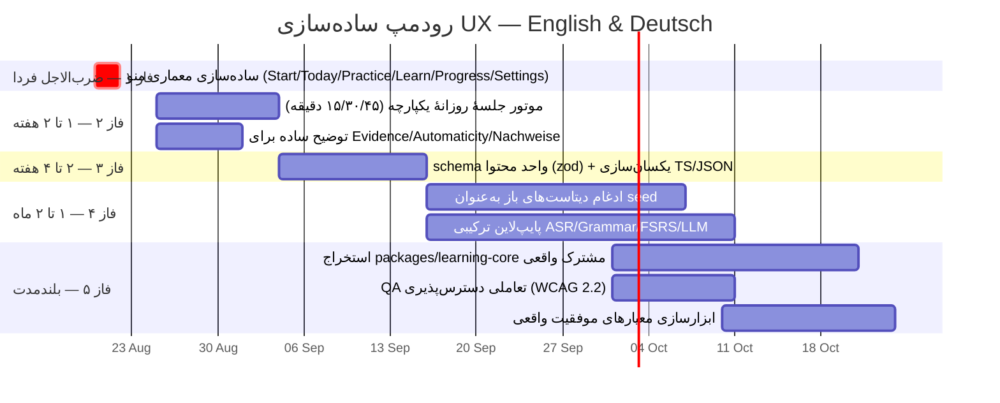

# رودمپ ساده‌سازی تجربهٔ کاربری — English & Deutsch — ۲۰۲۶-۰۸-۲۰

## وضعیت این سند

سند زنده است. هر بار که تغییری در کد `Apps/English/English-07082026` یا
`Apps/Deutsch-V10.08.2026` مرتبط با یکی از فازهای زیر انجام شود، وضعیت همان
فاز در این فایل و در نسخهٔ تصویری آن به‌روز می‌شود — نه فقط توضیح داده می‌شود.
نسخهٔ تصویری: `docs/reports/ux-simplification-roadmap-visual.html` (منتشرشده
به‌عنوان Artifact، همان لینک با هر آپدیت دوباره deploy می‌شود).

نمادهای وضعیت: ⬜ شروع‌نشده · 🟡 در حال انجام · ✅ انجام‌شده · 🔴 مسدود

## منشأ

این رودمپ از دو نقد مستقل ترکیب شده:

1. نقد Codex (۲۰۲۶-۰۸-۲۰) — بررسی بصری با اسکرین‌شات از هر دو اپ
   (`artifacts/dropdown-menu-audit-20260820/`)، شناسایی Conversation
   Studio به‌عنوان گیج‌کننده‌ترین بخش، و پیشنهاد اولیهٔ معماری منو + موتور
   جلسهٔ روزانه + فهرست دیتاست.
2. نقد Claude (همین گفتگو) — بررسی مستقیم کد
   (`packages/content/src`, صفحات `apps/web/app`, CSS لایه‌ای) که نشان داد
   مشکل مشترک هر دو اپ (و Tracker) رشد افزایشی ابعاد وضعیت/صفحه/محتوا بدون
   بازطراحی دوره‌ای است، و کد مشترک واقعی بین English/Deutsch صفر است
   (فقط با `shared/check-duplicated-files.mjs` کنترل می‌شود).

## نقشهٔ فازها

---

## فاز ۰ — نقد پایه (✅ انجام‌شده، ۲۰۲۶-۰۸-۲۰)

بررسی بصری (Codex) + بررسی کد (Claude) کامل شد. یافتهٔ مشترک: مشکل اصلی رنگ
یا زیبایی نیست، تعداد انتخاب‌ها و تکرار تصمیم‌هاست. Conversation Studio
گیج‌کننده‌ترین صفحه است چون فیلتر/حالت/مرحله/آمار هم‌زمان دیده می‌شوند و
طراحی‌اش با بقیهٔ اپ فرق دارد.

## فاز ۱ — ساده‌سازی معماری منو ✅ (تأیید شد ۲۰۲۶-۰۸-۲۰ ~۲۳:۵۰)

**بروزرسانی نهایی:** بعد از commit شدن کار Codex، بررسی و تست مستقیم کد نشان
داد هدف اصلی فاز ۱ از قبل پیاده شده: یک CTA غالب در Home هر دو اپ، و رفع
مشکل «دو Sidebar» در Conversation Studio (parity کامل بین English/Deutsch).
جزئیات کامل و نتیجهٔ typecheck/test واقعی:
`docs/roadmaps/PHASE-1-HANDOFF-2026-08-20.md` (فایل مشترک Claude/Codex).
باقی‌مانده: نام‌گذاری گروه‌های منوی جانبی — پایین‌اولویت.

**بدون داده جدید، کمترین ریسک.** بازآرایی ناوبری هر دو اپ به:

1. Start / Startseite — همیشه بیرون از Dropdown
2. Today / Heute
3. Practice ▼ (Mixed Training · Conversation Studio · Review)
4. Learn ▼ (Grammar · Vocabulary · PDF Reader)
5. Progress ▼ (Learning Evidence · Repair Items · Statistics)
6. Settings ▼

دکمهٔ Home در همهٔ صفحات در دسترس باشد. معیار پذیرش: در Home فقط یک CTA
غالب دیده شود، نه چند دکمهٔ شروع رقیب.

## فاز ۲ — موتور جلسهٔ روزانهٔ یکپارچه 🟡 (اسکلت پیاده شده ۲۰۲۶-۰۸-۲۰)

کامپوننت `DailyAutomaticityProgram` (هر دو اپ) از قبل انتخاب دقیقه و پیام
«هر مدت شامل همهٔ بخش‌ها می‌شود» را روی Home پیاده کرده — typecheck/test هر
دو اپ سبز. باقی‌مانده برای ✅ کامل: تطبیق دقیق جدول ۵ بخشی زیر با تعداد آیتم
واقعی هر بخش در کد (در حال حاضر فقط دقیقه انتخاب می‌شود، تخصیص per-بخش هنوز
بررسی نشده).

بعد از انتخاب زمان (۱۵/۳۰/۴۵ دقیقه)، کاربر دیگر بین Grammar/Studio/Review/
Mixed تصمیم نگیرد؛ موتور برنامه بر اساس جدول زیر جلسه را بسازد:

| بخش روزانه | ۱۵ دقیقه | ۳۰ دقیقه | ۴۵ دقیقه |
|---|---:|---:|---:|
| Wiederholen / Recall | ۳ | ۵ | ۷ |
| Mixed Training | ۳ | ۶ | ۱۰ |
| Conversation Studio | ۴ | ۸ | ۱۲ |
| Grammar & Repair | ۲ | ۵ | ۷ |
| Transfer به موقعیت جدید | ۳ | ۶ | ۹ |
| مجموع | ۱۵ | ۳۰ | ۴۵ |

نسخهٔ ۴۵ دقیقه‌ای فقط کشیده‌شدهٔ نسخهٔ ۱۵ دقیقه‌ای نباشد — گفتار طولانی‌تر،
نوشتن مستقل، دو زمینهٔ جدید. ارتقای سطح بر پایهٔ کیفیت شواهد باشد نه تعداد
دقیقه/XP.

## فاز ۳ — توضیح ساده برای اصطلاحات فنی ⬜

Evidence، Automaticity، Nachweise در Progress/Evidence باید یک توضیح
یک‌خطی به زبان زبان‌آموز داشته باشند (نه واژهٔ فنی بدون تعریف).

## فاز ۴ — schema واحد محتوا ⬜

- تعریف schema مشترک (zod) برای واحد محتوایی (سطح CEFR، مثال، صوت، ترجمه،
  recognition/writing/speaking/repair/transfer).
- انتقال باقیماندهٔ محتوای انگلیسی از آرایهٔ TS دستی
  (`packages/content/src/authored/*.ts`, `generated/grammar.ts`) به همان
  الگوی JSON اعتبارسنجی‌شده که آلمانی تا حدی دارد (`data/grammar.json`).
- اسکریپت validate محتوا در CI/pre-commit.

## فاز ۵ — ادغام دیتاست‌های باز (به‌عنوان seed، نه Installer) ⬜

کاتالوگ فعلی (`packages/content/src/open-language-datasets.ts` در هر دو اپ)
فقط metadata است، دانلود/آموزش واقعی انجام نشده. اولویت ادغام:

| دیتاست | کاربرد | مجوز/محدودیت |
|---|---|---|
| Tatoeba CC0 | جملهٔ کوتاه دوزبانه برای Reading/Transformation | صوت هر فایل مجوز جدا دارد |
| Mozilla Common Voice | تنوع گویندگان برای ارزیابی ASR | معیار تلفظ زبان‌آموز نیست؛ CC0 |
| MERLIN | خطای واقعی زبان‌آموز آلمانی + سطح CEFR | CC BY-SA |
| UD English EWT / German GSD | نقش کلمه/حالت/ترتیب کلمات | برچسب CEFR ندارد |
| FLEURS | Benchmark مقایسه‌ای ASR | برای محتوای آموزشی مناسب نیست |
| W&I + LOCNESS, C4 200M GEC | پیش‌آموزش تصحیح خطای نوشتاری | قبل از استفادهٔ تجاری بررسی مجوز لازم است |

محتوای اصلی درس هم‌چنان باید توسط مدرس و بر پایهٔ CEFR کامل (نه فقط Grammar
— تعامل/میانجی‌گری/گفتار) نوشته و بازبینی شود.

## فاز ۶ — پایپ‌لاین ترکیبی هوش مصنوعی ⬜

- **Rule Engine**: زمان‌بندی، حداقل طول پاسخ، مرور تأخیری، انتقال به
  موقعیت جدید — منطق شفاف، نه مدل.
- **ASR**: Whisper آماده برای transcript؛ خروجی تنها ورودی است، نمرهٔ
  تلفظ نیست.
- **Grammar**: LanguageTool + قواعد اختصاصی + تحلیل UD؛ فقط پیشنهاد، جایگزین
  خودکار متن زبان‌آموز نه.
- **LLM**: فقط تولید تمرین شخصی/توضیح ساده/پیشنهاد بازنویسی با خروجی JSON؛
  تصمیم تسلط/ارتقای سطح را Rule Engine می‌گیرد.
- **Spaced Repetition**: FSRS برای زمان‌بندی مرور بعدی (Difficulty/
  Stability/Retrievability).
- **Offline-first PWA**: IndexedDB محلی + صف همگام‌سازی هنگام اتصال.

## فاز ۷ — استخراج پکیج مشترک واقعی ⬜

الان English و Deutsch معماری تقریباً یکسان دارند (همان نام فایل‌های CSS
لایه‌ای، همان مدل ۵بعدی) ولی فقط با کپی+`check-duplicated-files.mjs` سازگار
نگه داشته می‌شوند — هر باگ باید دوبار fix شود. هدف: یک پکیج واقعی
(`packages/learning-core` یا مشابه) در Bun workspace شامل مدل CEFR/
automaticity، schema محتوا، و منطق وضعیت (به سبک همان بازسازی که امروز در
Tracker با `lib/study-progress.ts` انجام شد)، به‌علاوه توکن‌های طراحی مشترک
واقعی (import، نه دو پوشهٔ CSS هم‌نام جدا).

## فاز ۸ — QA تعاملی دسترس‌پذیری ⬜

از روی اسکرین‌شات قابل تأیید نیست: WCAG 2.2، ترتیب فوکوس کیبورد، Screen
Reader، عملکرد میکروفون، بازیابی خطا. حداقل برای نسخهٔ وب: reflow در عرض
۳۲۰px، فوکوس آشکار، هدف‌های لمسی مناسب.

## فاز ۹ — ابزارسازی معیارهای موفقیت واقعی ⬜

جایگزین تعداد کلیک/XP/پایان صفحه:

- زمان رسیدن از Start تا اولین پاسخ گفتاری
- بازیابی درست بدون دیدن جواب
- توانایی صحبت‌کردن ۴۵ تا ۶۰ ثانیه
- اصلاح مستقل خطا
- استفاده از همان ساختار بعد از ۱، ۳ و ۷ روز
- انتقال ساختار به موضوع جدید
- نرخ خطای کاذب Grammar/ASR

---

## تاریخچهٔ به‌روزرسانی

- **۲۰۲۶-۰۸-۲۰**: ایجاد سند، فاز ۰ انجام‌شده ثبت شد، فازهای ۱ تا ۹ ⬜.
